## Excercise 1 - Single writer and single domain

### Synopsis

In Exercise 1, we will set up two Docker containers: one MXL writer to generate a video flow and one MXL reader to consume it. This exercise will introduce you to fundamental MXL concepts:

* MXL Domain: The foundational directory structure where all MXL flows are stored.
* NMOS IS-04 Flow Resource Definition: A JSON file that uniquely describes an MXL flow within the domain.

You will then use the mxl-info tool to list and inspect the available flow within the MXL domain, providing insight into its characteristics.

```mermaid
   graph
      direction LR
         subgraph Node/Host
            subgraph docker_writer [docker]
                  direction LR
                  gstreamer_writer[Gstreamer writer]
                  mxl_sdk_writer[MXL SDK]
                  gstreamer_writer --> mxl_sdk_writer
            end

            subgraph docker_reader [docker]
                  direction LR
                  gstreamer_reader[Gstreamer Reader]
                  mxl_sdk_reader[MXL SDK]
                  mxl_sdk_reader --> gstreamer_reader
            end

            tmpfs([tmpfs<br>/Volumes/mxl/domain_1])

            mxl_sdk_writer --> tmpfs
            tmpfs --> mxl_sdk_reader
         end

         %% Styling
         linkStyle default stroke:black,stroke-width:2px
         style docker_writer fill:#cce6ff,color:black,stroke:#333,stroke-width:3px
         style docker_reader fill:#cce6ff,color:black,stroke:#333,stroke-width:3px
         style gstreamer_writer fill:#66b3ff,color:black,stroke:#333,stroke-width:2px
         style gstreamer_reader fill:#66b3ff,color:black,stroke:#333,stroke-width:2px
         style mxl_sdk_writer fill:#007bff,color:black,stroke:#333,stroke-width:2px,color:#fff
         style mxl_sdk_reader fill:#007bff,color:black,stroke:#333,stroke-width:2px,color:#fff
         style tmpfs fill:#ffe0b3,color:black,stroke:#333,stroke-width:2px
```



### Steps

1. Clone repo  
   ```sh
   git clone https://github.com/cbcrc/mxl-hands-on
   ```
1. Go to exercise 1 folder  
   ```sh
   cd ~/mxl-hands-on/docker/exercise-1
   ```
1. Look at the docker-compose.yaml file and notice the volume used by both containers  
   ```sh
   cat docker-compose.yaml
   ```
1. If you did **NOT** do the preparations steps for either WLS or MacOS, make sure you have a /Volumes/mxl mounted in *tmpfs* or *ram*.
   ```sh
   mount -t tmpfs -o size=512m tmpfs /Volumes/mxl # on WSL linux
   ```
   ```sh
   diskutil erasevolume HFS+ mxl $(hdiutil attach -nomount ram://1048576) # on MacOS
   ```
1. Start the containers with the provided .yaml file  
   ```sh
   docker compose up -d
   ```
1. Look at the containers running  
   ```sh
   docker container ls
   ```
1. Look at the MXL domain file as seen by the reader app.  
   ```sh
   docker exec exercise-1-reader-media-function-1 ls /domain
   ```
1. Store the flow ID of flow 1 in a local variable called **FLOW1_ID**
   ```sh
   FLOW1_ID=5fbec3b1-1b0f-417d-9059-8b94a47197ed
   ```
1. Have a look in all the sub repository of /domain  
   ```sh
   docker exec exercise-1-reader-media-function-1 ls /domain/$FLOW1_ID.mxl-flow
   ```
1. Look at the MXL domain_1 file structure on the host  
   ```sh
   ls /Volumes/mxl/domain_1 && ls /Volumes/mxl/domain_1/$FLOW1_ID.mxl-flow
   ```
1. Confirm that the MXL domain file structure is mounted in ram by confirming the filesystem is *tmpfs*  
   ```sh
   df -h /Volumes/mxl
   ```
1. Look at the NMOS IS-04 Flow definition in the /domain/flowId.mxl-flow/video.json and observe the parameters  
   ```sh
   docker exec exercise-1-reader-media-function-1 cat /domain/$FLOW1_ID.mxl-flow/.json
   ```
1. Use mxl-info to get flow information from the mxl reader, you can use watch in front of the command to have live update  
   ```sh
   docker exec exercise-1-reader-media-function-1 /app/mxl-info -d /domain -f $FLOW1_ID
   ```
1. Look inside the repository of the grains on the host and confirm that you have all the grain according to the grain count value observed in the step before  
   ```sh
   ls /Volumes/mxl/domain_1/$FLOW1_ID.mxl-flow/grains
   ```
1. Looking at a specific grain (1 frame of video) using FFMPEG and converting it into a picture. As the video data is packed into memory using v210, it is easy to take FFMPEG to convert the raw video data into a picture. 
   ```sh
   ffmpeg  -f rawvideo -pix_fmt yuv422p10le -s 1920x1080 -c:v v210 -i /Volumes/mxl/domain_1/$FLOW1_ID.mxl-flow/grains/data.1 out.png -y
   ```

1. Use your favorite picture viewer to look at out.png

1. Shut down the containers of excercise 1  
   ```sh
   docker compose down
   ```
1. look at the MXL domain file structure on the host again and notice that the file are gone.  
   ```sh
   ls /Volumes/mxl/domain_1
   ```


### Extra information

The MXL domain is a fundamental concept in the Media Exchange Layer. It acts as the central shared memory space where all media flows and their associated metadata reside. Understanding its file structure is important for working with MXL.

#### MXL Domain File Structure Explained
The MXL domain follows a specific hierarchy to organize flows and their data. Here's a breakdown of the key components within `${mxlDomain}` (the base directory of your MXL domain, e.g., `/dev/shm/mxl/domain_1` in this exercise):

|Path|Description|
|:---|:---|
|${mxlDomain}/|Base directory of the MXL domain|
|${mxlDomain}/${flowId}.mxl-flow/|Directory containing resources associated with a flow with uuid ${flowId}|
|${mxlDomain}/${flowId}.mxl-flow/data|Flow header. contains metadata for a flow ring buffer. Memory mapped by readers and writers.|
|${mxlDomain}/${flowId}.mxl-flow/.json|NMOS IS-04 Flow resource definition.|
|${mxlDomain}/${flowId}.mxl-flow/.access|File 'touched' by readers (if permissions allow it) to notify flow access. Enables reliable 'lastReadTime' metadata update.|
|${mxlDomain}/${flowId}.mxl-flow/grains/|Directory where individual grains are stored.|
|${mxlDomain}/${flowId}.mxl-flow/grains/${grainIndex}|Grain Header and optional payload (if payload is in host memory and not device memory ). Memory mapped by readers and writers|

#### Understanding `tmpfs` and Memory-Mapped I/O
In Step 9, you confirmed that the MXL domain is mounted on a `tmpfs` filesystem. This is a very important design choice for MXL.

As noted, `tmpfs` is a temporary file storage facility in Unix-like operating systems that resides entirely in volatile memory (RAM), not on a persistent disk.  
  
You can read more about `tmpfs` here: https://www.kernel.org/doc/html/latest/filesystems/tmpfs.html


#### NMOS IS04 flow definiion  
`${mxlDomain}/<flowId>.mxl-flow/.json`: This JSON file is the NMOS IS-04 Flow Resource Definition. It is crucial as it uniquely describes the characteristics of the MXL flow. Key parameters you observed include:  

* `id`: The unique identifier (flowId) for this specific flow.
* `label`: A human-readable label for the flow.
* `media_type`: Crucially, this indicates the data model used to store the media into memory. For the initial development of MXL, this will be `"media_type": "video/v210"`, signifying uncompressed 10-bit YCbCr 4:2:2 video. As MXL evolves, other media_type values will be supported for different data formats.
* Other parameters like `frame_width`, `frame_height`, `interlace_mode`, `colorspace`, `components`, etc., provide detailed technical specifications of the video flow.

#### Interpreting mxl-info Output
Step 11 introduces you to the `mxl-info` tool, which is invaluable for inspecting the live state of an MXL flow. When you `run mxl-info -d /domain -f flowId`, pay close attention to the following fields:

* `Flow[FlowId]`: Confirms the ID of the flow being inspected.
* `grain count`: This value represents the depth of the circular buffer for that particular flow. It indicates how many historical grains (frames in this exercise) are currently available in the MXL domain for that flow. The mxl-writer continuously overwrites older grains once the buffer depth is reached.
* `latency`: It represents the time difference between the capture/generation timestamp of the latest available grain and the current time when mxl-info is executed.
In this exercise, with the writer generating grains @ 29.97 frames per second (30000/1001), each grain represents 33.36 milliseconds of video.
Therefore, the latency value will fluctuate between 0 and approximately 33 msec. A value close to 0 msec indicates you are very close to when the current grain was completed by the MXL writer, while a value closer to 33 msec means the current grain has been available for almost a full frame interval. This could potentially inticate issue in the system if this value goes beyond the time value of a grain.
* `grain rate`: Displays the nominal framerate of the flow, derived from the NMOS IS-04 definition.
### [Back to main page](../README.md)