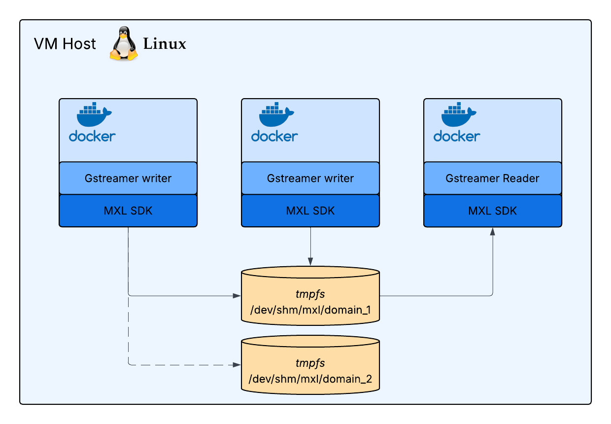

## Excercise 2 - Multiple writers and multiple domains

### Synopsis
Building on the foundational concepts from Exercise 1, this exercise will demonstrate how MXL handles **multiple concurrent video flows** and the concept of **domain separation**.

You will deploy three Docker containers: two MXL writers, each generating a unique video flow, and one MXL reader. We will explore how the reader interacts with multiple flows on the **same MXL domain**, observe the resulting file structure, and then **modify a writer's domain** to understand how flows can be isolated. This hands-on experience will solidify your understanding of MXL's domain-based organization.



### Setps

1. Go to excercise 2 folder  
   ```sh
   cd /home/lab/nts-hands-on/docker/excercise-2
   ```
1. Look at the docker-compose.yaml file and notice that we now have 2 writers and that all containers are mapped to the same MXL domain.  
   ```sh
   cat docker-compose.yaml
   ```
1. Start the containers with the provided .yaml file  
   ```sh
   docker compose up -d
   ```
1. Look at the containers running  
   ```sh
   docker ps
   ```
1. Look at the MXL domain file structure as seen by the reader app. Notice the second flow with a new unique ID  
   ```sh
   docker exec -it excercise-2-reader-media-function-1 ls /domain
   ```
1. Look at the MXL domain_1 file structure on the host.  
   ```sh
   ls /dev/shm/mxl/domain_1
   ```
1. Use mxl-info to get flow information from the mxl reader to get information of each flow  
   ```sh
   docker exec -it excercise-2-reader-media-function-1 /app/mxl-info -d /domain -l
   ```
1. Shut down the containers of excercise 2  
   ```sh
   docker compose down
   ```
1. Modify the docker-compose.yaml file to map the second writer to /dev/shm/mxl/domain_2  
   ```sh
   nano docker-compose.yaml and change line 14 for this: source: /dev/shm/mxl/domain_2
   ```
1. Start up the containers with the updated .yaml file  
   ```sh
   docker compose up -d
   ```
1. Look at the MXL domain file structure as seen by the reader app. Notice that we only see the flow of the first writer app after we change the domain of writer 2.  
   ```sh
   docker exec -it excercise-2-reader-media-function-1 ls /domain
   ```
1. Look at the MXL domain_1 and domain_2 file structure on the host and notice that both flows still exist but they are isolated by their MXL domain.  
   ```sh
   ls /dev/shm/mxl/domain_1 and ls /dev/shm/mxl/domain_2
   ```
1. Shudown containers of excercise 2  
   ```sh
   docker compose down
   ```


### Extra information exercise 2
This exercise expands on the foundational concepts introduced in Exercise 1 by demonstrating how MXL handles multiple media flows. Understanding how these flows coexist and how domains can provide isolation.

#### Coexistence of Multiple Flows within a Single Domain
In the initial setup of Exercise 2 (Steps 2 through 7), you observed two MXL writers contributing distinct video flows to the same MXL domain (`/dev/shm/mxl/domain_1`).  

* Unique Flow Identification: Even though both flows share the same root domain, MXL maintains strict separation and identification of each flow. This is achieved through:
	* Unique `flowIds`: As you observed in Step 5 (l`s /domain`), each flow gets its own distinct `flowId` (a UUID), which serves as its unique identifier within the domain.
	* Dedicated Flow Directories: Each `flowId` corresponds to its own dedicated directory (`<flowId>.mxl-flow`) within the domain's file structure. This ensures that the flow definition (e.g., `.json`) and the actual media grains for one flow are completely separate from another.
* `mxl-info -l` for Domain-Wide Overview: Step 7 introduces the `mxl-info -l` command. The `-l` (list) flag is usefull; it instructs mxl-info to scan the specified MXL domain and list all active flows within it. 

#### The Power of MXL Domains for Isolation
The core learning objective of the latter part of Exercise 2 (Steps 8 through 12) is to understand the concept of domain separation in MXL.

* **Logical and Physical Isolation:** By modifying the `docker-compose.yaml` file to map writer-2 to `/dev/shm/mxl/domain_2`, you effectively writing to a second, entirely separate MXL domain.
	* **Logical Isolation:** From the perspective of applications, a flow existing in `domain_1` is completely distinct and inaccessible to an application configured only to read from `domain_2`, and vice-versa.
	* **Physical Isolation:** As you confirmed in Step 12 (`ls /dev/shm/mxl/domain_1` and `ls /dev/shm/mxl/domain_2`), the two domains exist as independent directory structures on the host's `tmpfs` filesystem.
* **Use Cases for Multiple Domains:** The ability to establish multiple, isolated MXL domains is a fundamental feature for various architectural patterns:
	* **Security:** Different applications or user groups can be granted access only to specific domains, ensuring that sensitive media flows are isolated from less secure ones.
	* **Workload Separation:** High-sensitivity workflows, like playout, can be isolated in their own domain to prevent interference from other, less critical workflows, ensuring consistent operation of critical systems.
	* **Organizational Boundaries:** In large media systems, different production groups might operate their own distinct MXL domains to manage their media assets independently.
	* **Resource Management:** While tmpfs uses shared memory, creating separate domains can simplify resource allocation and monitoring for distinct sets of flows.
	* **Scalability:** While not directly demonstrated in this exercise, the concept of domains facilitates distributed architectures where different parts of a system might manage their own local MXL domains.

**Key Takeaway:** The concept of domains in MXL allows you to set up clear boundaries for your media workflows. Whether for security, isolation, organizational purposes, or robust resource management, multiple MXL domains provide the necessary separation and control for complex media exchange environments.
### [Back to main page](../README.md)