## Excercise 3 - Add VNC client for GUI and changing the attribute of one of the writer app

### Synopsis

In Exercise 3, we will enhance our MXL environment by integrating a **VNC client and a lightweight Linux desktop container**. This setup will provide a graphical interface, allowing you to **visualize the actual video output** from the MXL writer applications. Building on this, you will then learn how to **modify attributes of an MXL writer application**, specifically changing the overlay text on one of the video flows, and observing these changes live through the VNC viewer. This exercise will provide a tangible demonstration of MXL's video writer and reader test applications.

```mermaid
   graph
      direction LR
         subgraph WSL Linux
            subgraph docker_writer_1 [docker]
                  direction LR
                  gstreamer_writer_1[Gstreamer writer]
                  mxl_sdk_writer_1[MXL SDK]
                  gstreamer_writer_1 --> mxl_sdk_writer_1
            end
             
             subgraph docker_writer_2 [docker]
                  direction LR
                  gstreamer_writer_2[Gstreamer writer]
                  mxl_sdk_writer_2[MXL SDK]
                  gstreamer_writer_2 --> mxl_sdk_writer_2
            end

            subgraph docker_reader_1 [docker]
                  direction LR
                  gstreamer_reader_1[Gstreamer Reader]
                  mxl_sdk_reader_1[MXL SDK]
                  mxl_sdk_reader_1 --> gstreamer_reader_1
            end

            subgraph docker_reader_2 [docker]
               subgraph Linux_VNC [Linux with VNC]
                  direction LR
                  gstreamer_reader_2[Gstreamer Reader]
                  mxl_sdk_reader_2[MXL SDK]
                  mxl_sdk_reader_2 --> gstreamer_reader_2
               end           
            end

            tmpfs([tmpfs<br>/mxl/domain_1])

            mxl_sdk_writer_1 --> tmpfs
            mxl_sdk_writer_2 --> tmpfs
            tmpfs --> mxl_sdk_reader_1
            tmpfs --> mxl_sdk_reader_2
         end

         %% Styling
         linkStyle default stroke:black,stroke-width:2px
         style docker_writer_1 fill:#cce6ff,color:black,stroke:#333,stroke-width:3px
         style docker_writer_2 fill:#cce6ff,color:black,stroke:#333,stroke-width:3px
         style docker_reader_1 fill:#cce6ff,color:black,stroke:#333,stroke-width:3px
         style docker_reader_2 fill:#cce6ff,color:black,stroke:#333,stroke-width:3px
         style gstreamer_writer_1 fill:#66b3ff,color:black,stroke:#333,stroke-width:2px
         style gstreamer_writer_2 fill:#66b3ff,color:black,stroke:#333,stroke-width:2px
         style gstreamer_reader_1 fill:#66b3ff,color:black,stroke:#333,stroke-width:2px
         style gstreamer_reader_2 fill:#66b3ff,color:black,stroke:#333,stroke-width:2px
         style mxl_sdk_writer_1 fill:#007bff,color:white,stroke:#333,stroke-width:2px
         style mxl_sdk_writer_2 fill:#007bff,color:white,stroke:#333,stroke-width:2px
         style mxl_sdk_reader_1 fill:#007bff,color:white,stroke:#333,stroke-width:2px
         style mxl_sdk_reader_2 fill:#007bff,color:white,stroke:#333,stroke-width:2px
         style Linux_VNC fill:#f0f8ff,stroke:#333,stroke-width:2px,color:black
         style tmpfs fill:#ffe0b3,color:black,stroke:#333,stroke-width:2px
```



### Steps

1. Go to exercise 3 folder  
   ```sh
   cd /home/user/mxl-hands-on/docker/exercise-3
   ```
1. Look at the docker-compose.yaml file and notice the addition of the VNC-Viewer container. This container is there to give you acces to a desktop in order to be able to see video at the end of the exercise.
On your PC (if you are onsite in MTL), go to VNC web browser <<IP_ADDRESS>>:5900. If you are through VPN or elsewhere in Canada, you can RDP here in order to do so: 10.164.50.197 (credential to be provided)  
   ```sh
   cat docker-compose.yaml
   ```
1. Start the containers
   ```sh
   docker compose up -d
   ```
1. On your PC, go to VNC web browser 127.0.0.1:5900.
1. To install all the Gstreamer dependencies on your linux desktop, go to `Start Menu > System Tools > LXTerminal` and do the following commands.
   ```sh
   cd /root
   chmod +x install.sh
   ./install.sh
   ```
1. Look at the available MXL flows as seen by the VNC container 
   ```sh
   ls /domain
   ```
1. Store the first flow ID in a local variable and use it to start the Gstreamer sink app and actually see some video strait out of memory!!!
   ```sh
   FLOW1_ID=5fbec3b1-1b0f-417d-9059-8b94a47197ed
   ./mxl-gst-videosink -d /domain -f $FLOW1_ID # use one of the flow ID from the ls /domain command
   ```
1. Close the Gstreamer window and CTRL break the LXTerminal.  
1. Look at the other flow ID in the the domaine.  
   ```sh
   ls /domain
   ```
Whit what you learned so far, can you look at the video of the other MXL stream? Can you spot the difference and identify where it is comming from?  

   ``` 
   Hint: Carefully look at the docker-compose.yaml file
   ```
Can you change the text ident of flow 2 for you first name and look at it again to proove that it changed?

### Extra information for Exercise 3
Exercise 3 is transitioning from theoretical understanding and command-line inspection to direct visual confirmation of MXL's functionality. It also introduces the concept of dynamically influencing media flows, a key aspect of real-time broadcast and production environments.

#### Understanding the VNC Client and Graphical Interface
The addition of the `VNC-Viewer` Docker container serves several critical purposes:

* **Visualizing MXL Flows:** While `mxl-info` provides valuable metadata, seeing the actual video stream confirms that the MXL writer is correctly generating video grains and that the `mxl-gst-videosink` (a GStreamer-based MXL reader application) is successfully consuming and rendering them. This provides immediate, tangible feedback on the entire MXL skd.
* **Emulating a Media Function:** The VNC container, with its GStreamer installation, effectively acts as a "media function" – a common component in broadcast systems that processes or displays media. It demonstrates how a separate application can interface with the MXL domain to access and utilize media streams.


#### Exploring `mxl-gst-videotestsrc` and `mxl-gst-videosink`  
* `mxl-gst-videotestsrc` **(Writer):** This is the GStreamer-based application used by your MXL writers to generate video. In this exercise, you're interacting with the `-t` parameter.
	* The `-t` (text overlay) parameter allows you to add a customizable text string directly onto the video frames generated by the `videotestsrc`.
* `mxl-gst-videosink` **(Reader/Viewer):** This application acts as an MXL reader and uses GStreamer to display the video.
	* It takes the `-d` (domain) and `-f` (flow ID) parameters to specify which MXL domain to connect to and which specific flow to consume.
	* It translates the MXL grains (V210 format in this case) into a displayable video stream.
### [Back to main page](../README.md)