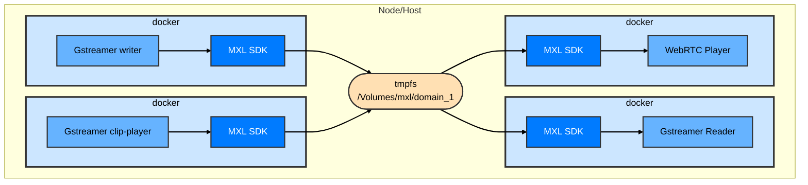

## Exercise 3 - Add VNC client for GUI and changing the attribute of one of the writer app

### Synopsis

In Exercise 3, we will enhance our MXL environment by integrating a **VNC client with a lightweight Linux desktop container**. This setup provides a graphical interface that allows you to visualize actual video outputs from MXL writer applications in real-time. 

You'll learn how to **modify attributes of an MXL writer application** - specifically changing the overlay text on one of the video flows - and observe these changes immediately through the VNC viewer.

This exercise also showcases the gstreamer clip player plugin (added in [PR #22](https://github.com/dmf-mxl/mxl/pull/22)), which enables media transport stream files to be written directly into an MXL domain. Together, these components provide a tangible demonstration of MXL's capabilities through interactive video writer and reader test applications.


```mermaid
   graph
      direction LR
         subgraph Node/Host
            subgraph docker_writer_1 [docker]
                  direction LR
                  gstreamer_writer_1[Gstreamer writer]
                  mxl_sdk_writer_1[MXL SDK]
                  gstreamer_writer_1 --> mxl_sdk_writer_1
            end
             
             subgraph docker_writer_2 [docker]
                  direction LR
                  gstreamer_writer_2[Gstreamer clip-player]
                  mxl_sdk_writer_2[MXL SDK]
                  gstreamer_writer_2 --> mxl_sdk_writer_2
            end

            subgraph docker_reader_1 [docker]
                  direction LR
                  gstreamer_reader_1[Gstreamer Reader]
                  mxl_sdk_reader_1[MXL SDK]
                  mxl_sdk_reader_1 --> gstreamer_reader_1
            end

            subgraph docker_reader_2 [docker]
               direction LR
               gstreamer_reader_2[WebRTC Player]
               mxl_sdk_reader_2[MXL SDK]
               mxl_sdk_reader_2 --> gstreamer_reader_2
            end

            tmpfs([tmpfs<br>/Volumes/mxl/domain_1])

            mxl_sdk_writer_1 --> tmpfs
            mxl_sdk_writer_2 --> tmpfs
            tmpfs --> mxl_sdk_reader_1
            tmpfs --> mxl_sdk_reader_2
         end

         %% Styling
         linkStyle default stroke:black,stroke-width:2px
         style docker_writer_1 fill:#cce6ff,color:black,stroke:#333,stroke-width:3px
         style docker_writer_2 fill:#cce6ff,color:black,stroke:#333,stroke-width:3px
         style docker_reader_1 fill:#cce6ff,color:black,stroke:#333,stroke-width:3px
         style docker_reader_2 fill:#cce6ff,color:black,stroke:#333,stroke-width:3px
         style gstreamer_writer_1 fill:#66b3ff,color:black,stroke:#333,stroke-width:2px
         style gstreamer_writer_2 fill:#66b3ff,color:black,stroke:#333,stroke-width:2px
         style gstreamer_reader_1 fill:#66b3ff,color:black,stroke:#333,stroke-width:2px
         style gstreamer_reader_2 fill:#66b3ff,color:black,stroke:#333,stroke-width:2px
         style mxl_sdk_writer_1 fill:#007bff,color:white,stroke:#333,stroke-width:2px
         style mxl_sdk_writer_2 fill:#007bff,color:white,stroke:#333,stroke-width:2px
         style mxl_sdk_reader_1 fill:#007bff,color:white,stroke:#333,stroke-width:2px
         style mxl_sdk_reader_2 fill:#007bff,color:white,stroke:#333,stroke-width:2px
         style tmpfs fill:#ffe0b3,color:black,stroke:#333,stroke-width:2px
```

### Steps

1. Go to exercise 3 folder  

   ```sh
   cd ~/mxl-hands-on/docker/exercise-3
   ```

1. Identify the mxl domain with a domain_def.json in to allow the webRTC player application to discover mxl flows in the domain.

   ```sh
   cp ./data/domain_def.json /Volumes/mxl/domain_1
   ```

1. Look at the docker-compose.yaml file and notice the addition of the mxl2webrtc and mediamtx containers. These containers are there to give you access to a web application that will convert mxl flow into webrtc and display them in your browser.

   ```sh
   cat docker-compose.yaml
   ```

1. Start the containers

   ```sh
   docker compose up -d # For linux based system
   ```
   ```sh
   ./start-mac.sh # For mac based system
   ```

1. Use the WebRTC player application to look at the newly created mxl flows. You can reach the webRTC player in your browser with the following information:

| App | URL | API Swagger Page |
|-----|-----|-----|
| MXL to WebRTC | http://localhost:9601 | http://localhost:9601/docs |

With what you learned so far, can you look at all mxl flows? 

When you are done experimenting, do not forget to shutdown your containers.
   ```sh
   docker compose down # For linux based system
   ```
   ```sh
   ./stop-mac.sh # For mac based system
   ```

### Extra information for Exercise 3

Exercise 3 is transitioning from theoretical understanding and command-line inspection to direct visual confirmation of MXL's functionality. It also introduces the concept of dynamically influencing media flows, a key aspect of real-time broadcast and production environments.

#### Exploring `mxl-gst-testsrc` and `mxl-gst-sink`  

- `mxl-gst-testsrc` **(Writer):** This is the GStreamer-based application used by your MXL writers to generate video and audio. In this exercise, you're interacting with the `-t` parameter.
  - The `-t` (text overlay) parameter allows you to add a customizable text string directly onto the video frames generated by the `videotestsrc`.
- `mxl-gst-sink` **(Reader/Viewer):** This application acts as an MXL reader and uses GStreamer to display the video.
  - It takes the `-d` (domain) and `-v` (video flow ID) or `-a`(audio flow ID) parameters to specify which MXL domain to connect to and which specific flow to consume.
  - It translates the MXL grains (V210 format in this case) into a displayable video stream.

### [Back to main page](../README.md)