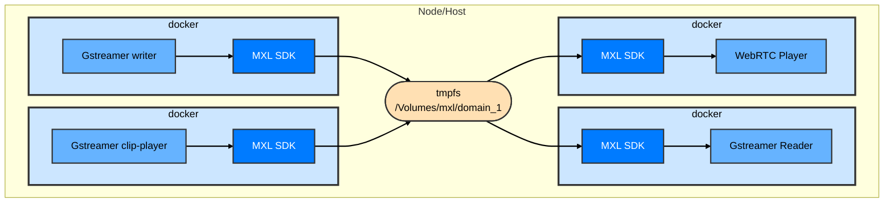

## Exercise 3 - Watch MXL flows in your browser with a WebRTC player

### Synopsis

In Exercise 3, we will add a **WebRTC player** to our MXL environment. The mxl2webrtc application reads MXL flows and sends them to your browser through MediaMTX, a WebRTC media server, so you can watch the actual video and listen to the audio produced by MXL writer applications in real time.

This exercise also showcases the gstreamer clip player plugin (added in [PR #22](https://github.com/dmf-mxl/mxl/pull/22)), which enables media transport stream files to be written directly into an MXL domain. Together, these components provide a tangible demonstration of MXL's capabilities through interactive video writer and reader test applications.


```mermaid
   graph
      direction LR
         subgraph Node/Host
            subgraph docker_writer_1 [docker]
                  direction LR
                  gstreamer_writer_1[Gstreamer writer]
                  mxl_sdk_writer_1[MXL SDK]
                  gstreamer_writer_1 --> mxl_sdk_writer_1
            end
             
             subgraph docker_writer_2 [docker]
                  direction LR
                  gstreamer_writer_2[Gstreamer clip-player]
                  mxl_sdk_writer_2[MXL SDK]
                  gstreamer_writer_2 --> mxl_sdk_writer_2
            end

            subgraph docker_reader_1 [docker]
                  direction LR
                  gstreamer_reader_1[Gstreamer Reader]
                  mxl_sdk_reader_1[MXL SDK]
                  mxl_sdk_reader_1 --> gstreamer_reader_1
            end

            subgraph docker_reader_2 [docker]
               direction LR
               gstreamer_reader_2[WebRTC Player]
               mxl_sdk_reader_2[MXL SDK]
               mxl_sdk_reader_2 --> gstreamer_reader_2
            end

            tmpfs([tmpfs<br>/Volumes/mxl/domain_1])

            mxl_sdk_writer_1 --> tmpfs
            mxl_sdk_writer_2 --> tmpfs
            tmpfs --> mxl_sdk_reader_1
            tmpfs --> mxl_sdk_reader_2
         end

         %% Styling
         linkStyle default stroke:black,stroke-width:2px
         style docker_writer_1 fill:#cce6ff,color:black,stroke:#333,stroke-width:3px
         style docker_writer_2 fill:#cce6ff,color:black,stroke:#333,stroke-width:3px
         style docker_reader_1 fill:#cce6ff,color:black,stroke:#333,stroke-width:3px
         style docker_reader_2 fill:#cce6ff,color:black,stroke:#333,stroke-width:3px
         style gstreamer_writer_1 fill:#66b3ff,color:black,stroke:#333,stroke-width:2px
         style gstreamer_writer_2 fill:#66b3ff,color:black,stroke:#333,stroke-width:2px
         style gstreamer_reader_1 fill:#66b3ff,color:black,stroke:#333,stroke-width:2px
         style gstreamer_reader_2 fill:#66b3ff,color:black,stroke:#333,stroke-width:2px
         style mxl_sdk_writer_1 fill:#007bff,color:white,stroke:#333,stroke-width:2px
         style mxl_sdk_writer_2 fill:#007bff,color:white,stroke:#333,stroke-width:2px
         style mxl_sdk_reader_1 fill:#007bff,color:white,stroke:#333,stroke-width:2px
         style mxl_sdk_reader_2 fill:#007bff,color:white,stroke:#333,stroke-width:2px
         style tmpfs fill:#ffe0b3,color:black,stroke:#333,stroke-width:2px
```

### Steps

1. Go to exercise 3 folder  

   ```sh
   cd ~/mxl-hands-on/docker/exercise-3
   ```

1. Identify the mxl domain with a domain_def.json in to allow the webRTC player application to discover mxl flows in the domain. On Mac, skip this step: the start script does it for you.

   ```sh
   cp ./data/domain_def.json /Volumes/mxl/domain_1/ # For linux based system
   ```

1. Look at the docker-compose.yaml file and notice the addition of the mxl2webrtc and mediamtx containers. These containers are there to give you access to a web application that will convert mxl flow into webrtc and display them in your browser.

   ```sh
   cat docker-compose.yml
   ```

1. ⚠️ Docker Compose only downloads images that are missing. If you pulled the images in an earlier session, update them first.

   ```sh
   docker compose pull
   ```

1. Start the containers

   ```sh
   docker compose up -d # For linux based system
   ```
   ```sh
   ./start-mac.sh # For mac based system
   ```

1. Use the WebRTC player application to look at the newly created mxl flows. You can reach the webRTC player in your browser with the following information:

   | App | URL | API Swagger Page |
   |-----|-----|-----|
   | MXL to WebRTC | http://localhost:9601 | http://localhost:9601/docs |

   With what you learned so far, can you look at all mxl flows? 

1. When you are done experimenting, do not forget to shutdown your containers.
   ```sh
   docker compose down # For linux based system
   ```
   ```sh
   ./stop-mac.sh # For mac based system
   ```

### Extra information for Exercise 3

Exercise 3 is transitioning from theoretical understanding and command-line inspection to direct visual confirmation of MXL's functionality.

#### The applications in this exercise

- `mxl-gst-testsrc` **(Writer):** This is the GStreamer-based application used by your MXL writers to generate video and audio.
  - The `-t` (text overlay) parameter adds a text string directly onto the video frames generated by the `videotestsrc`. Look for `Original Flow` in docker-compose.yml and in the player.
- `mxl-gst-looping-filesrc` **(Clip player):** Plays a transport stream file in a loop (`-i /app/sizzle.ts`) and writes its video and audio into the MXL domain.
- `mxl2webrtc` **(Reader/Player):** Reads MXL flows, converts the MXL grains (V210 video and audio samples) into a WebRTC stream, and publishes it to MediaMTX, which serves it to your browser.

### [Back to main page](../README.md)
