# Exercise 4 - FFmpeg with MXL: Clip Playback and RTP Streaming

## Synopsis

In Exercise 4, we will explore using **FFmpeg with MXL support** as an alternative to GStreamer for media processing workflows. This exercise demonstrates the *intended* workflow where FFmpeg can read video files, write them to an MXL domain, and then read from the MXL domain to stream content via RTP (Real-time Transport Protocol).

You will learn to:

* Use FFmpeg to decode video files and write to MXL domains
* Read MXL flows using FFmpeg's MXL demuxer
* Stream video content via RTP transport streams
* Understand the integration between FFmpeg and MXL

This exercise showcases the versatility of MXL by demonstrating interoperability with different media frameworks beyond GStreamer.

```mermaid
   graph
      direction LR
         subgraph Node/Host
            subgraph docker_writer [docker]
                  direction LR
                  ffmpeg_writer[FFmpeg<br/>MXL Writer]
                  video_file[(Video File)]
                  mxl_sdk_writer[MXL SDK]
                  video_file --> ffmpeg_writer
                  ffmpeg_writer --> mxl_sdk_writer
            end

            subgraph docker_reader [docker]
                  direction LR
                  ffmpeg_reader[FFmpeg<br/>MXL Reader<br/>RTP Streamer]
                  mxl_sdk_reader[MXL SDK]
                  mxl_sdk_reader --> ffmpeg_reader
            end

            tmpfs([tmpfs<br>/Volumes/mxl/domain_1])

            mxl_sdk_writer --> tmpfs
            tmpfs --> mxl_sdk_reader
            ffmpeg_reader --> rtp_output[RTP Stream<br/>udp://0.0.0.0:5004]
         end

         %% Styling
         linkStyle default stroke:black,stroke-width:2px
         style docker_writer fill:#cce6ff,color:black,stroke:#333,stroke-width:3px
         style docker_reader fill:#cce6ff,color:black,stroke:#333,stroke-width:3px
         style ffmpeg_writer fill:#66b3ff,color:black,stroke:#333,stroke-width:2px
         style ffmpeg_reader fill:#66b3ff,color:black,stroke:#333,stroke-width:2px
         style mxl_sdk_writer fill:#007bff,color:black,stroke:#333,stroke-width:2px,color:#fff
         style mxl_sdk_reader fill:#007bff,color:black,stroke:#333,stroke-width:2px,color:#fff
         style tmpfs fill:#ffe0b3,color:black,stroke:#333,stroke-width:2px
         style video_file fill:#90EE90,color:black,stroke:#333,stroke-width:2px
         style rtp_output fill:#FFB6C1,color:black,stroke:#333,stroke-width:2px
```



## Steps

### 1. Clone repo (if not already done)

```sh
git clone https://github.com/cbcrc/mxl-hands-on.git
cd mxl-hands-on
```

### 2. Prepare the MXL domain

Create the shared memory domain directory that will be used by both FFmpeg containers:

```sh
sudo mkdir -p /Volumes/mxl/domain_1
```

### 3. Navigate to Exercise 4 directory and start services

```sh
cd docker/exercise-4
docker compose up -d
```

This will start two services:

* **ffmpeg-writer**: Reads a video file (or generates test pattern) and writes it to the MXL domain
* **ffmpeg-rtp-streamer**: Reads from the MXL domain and streams via RTP

> **Note**: The exercise uses a pre-built Docker image `ghcr.io/cbcrc/mxl-ffmpeg:latest` with FFmpeg compiled with MXL support. If you're interested in building this image yourself, see the [Advanced: Building the FFmpeg-MXL Image](#advanced-building-the-ffmpeg-mxl-image) section at the end of this document.

### 4. Verify the MXL flow is created

Check that the FFmpeg writer has created an MXL flow:

```sh
ls -la /Volumes/mxl/domain_1/
```

You should see `.mxl-flow` and `.mxl-flow-data` files with a UUID as the filename.

### 5. Monitor the RTP stream

The ffmpeg-rtp-streamer service is configured to output an RTP stream on UDP port 5004. You can monitor this stream using:

**Option A: Using FFplay (if you have FFmpeg installed locally)**

```sh
ffplay -protocol_whitelist file,udp,rtp -i rtp://127.0.0.1:5004
```

**Option B: Using VLC Media Player**

1. Open VLC
2. Go to Media → Open Network Stream
3. Enter: `rtp://127.0.0.1:5004`
4. Click Play

### 6. Inspect the logs

Check the FFmpeg writer logs:

```sh
docker logs ffmpeg-writer
```

Check the FFmpeg RTP streamer logs:

```sh
docker logs ffmpeg-rtp-streamer
```

### 7. Experiment with different video sources

You can modify the docker-compose.yaml to use different video files or even live sources:

**Using FFmpeg test pattern:**

```yaml
command: >
  ffmpeg -re -f lavfi -i testsrc2=size=1920x1080:rate=30
  -c:v v210 -f mxl
  -video_flow_id 11111111-2222-3333-4444-555555555555
  /domain
```

**Using a different video file:**
Place your video file in the `data` directory and update the mount and command in docker-compose.yaml.

### 8. Stop the services

```sh
docker compose down
```

## Key Concepts Covered

### FFmpeg MXL Muxer

The FFmpeg MXL muxer (`-f mxl`) writes media to an MXL domain. Key options:

* `-video_flow_id <UUID>`: Specify a custom flow ID
* `-audio_flow_id <UUID>`: Specify audio flow ID (for audio streams)
* The output path is the MXL domain directory

### FFmpeg MXL Demuxer

The FFmpeg MXL demuxer reads `.mxl-flow` files from the domain:

```sh
ffmpeg -i /domain/<flow-id>.mxl-flow ...
```

### RTP Streaming

FFmpeg can stream to RTP with various options:

```sh
ffmpeg -i input -f rtp rtp://host:port
```

For more control, you can use SDP files or specify codec parameters.

### Advanced Exploration

#### 1. Inspect MXL flow metadata
Use the mxl-info tool (from Exercise 1) to inspect the flow created by FFmpeg:
```sh
docker exec -it ffmpeg-writer mxl-info --domain /domain --flow <flow-id>
```

#### 2. Multi-format workflow
Try a workflow that converts between formats through MXL:
- FFmpeg writer: H.264 → MXL (v210)
- FFmpeg reader: MXL (v210) → RTP (H.264)

#### 3. Audio + Video
Modify the commands to handle both audio and video streams:
```sh
ffmpeg -re -i input.mp4 \
  -map 0:v:0 -c:v v210 -f mxl -video_flow_id <video-uuid> /domain & \
  -map 0:a:0 -c:a pcm_f32le -f mxl -audio_flow_id <audio-uuid> /domain
```

### Troubleshooting

#### "Cannot write to MXL domain"
- Ensure the domain directory exists and has proper permissions
- Check that the directory is mounted correctly in the container

#### "MXL flow not found"
- Verify the flow ID matches the UUID in the domain directory
- Check that the writer container is running and has created the flow

#### "RTP stream not playing"
- Ensure the port (5004) is not blocked by firewall
- Check that the reader container is running
- Verify the RTP URL matches the configured port

#### "Permission denied on /Volumes/mxl/domain_1"
On macOS, you may need to grant full disk access:
- System Preferences → Security & Privacy → Privacy → Full Disk Access
- Add Terminal or Docker

### Comparison: FFmpeg vs GStreamer with MXL

| Feature | FFmpeg | GStreamer |
|---------|--------|-----------|
| MXL Integration | Native demuxer/muxer | Plugin-based |
| Command-line | Single binary (`ffmpeg`) | Multiple tools (`gst-launch-1.0`) |
| Codec Support | Extensive built-in | Plugin-based |
| Scripting | Easier for batch processing | More flexible pipeline |
| Performance | Generally faster for simple tasks | Better for complex pipelines |

### Next Steps

- Explore the [FFmpeg-MXL README](../ffmpeg-mxl/README.md) for detailed build instructions
- Review the FFmpeg MXL integration code in `libavformat/mxldec.c` and `libavformat/mxlenc.c`
- Experiment with different video codecs and formats
- Try creating workflows that mix FFmpeg and GStreamer (both reading/writing to the same MXL domain)

---
