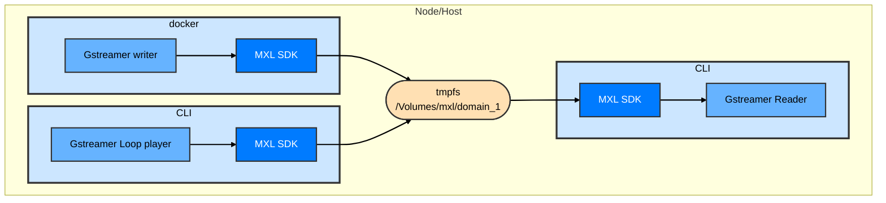

## Exercise 4 - Exploring portable mxl reference apps in a simple setup.

### Synopsis

In Exercise 4, we will set up one Docker containers: one MXL writer container to generate a video flow and an audio flow. We will then use the portables apps to consume both flows and generate an extra flow. The portable apps will be used directly in CLI.

This leverage all other concepts learned in previous exercises.

### Audio does not work well with type 2 hypervisors.



### Steps

1. Go to exercise 4 folder  
   ```sh
   cd ~/mxl-hands-on/docker/exercise-4
   ```
1. Inspect the content of the docker-compose.yaml. By looking at it, you should be able to deduct how many flows and where they will be created.  
   ```sh
   cat docker-compose.yaml
   ```
1. Start the container with the provided .yaml file  
   ```sh
   docker compose up -d
   ```
1. Make sure the container is running correctly.  
   ```sh
   docker container ls
   ```
1. Verify that both flows are present in the domain.
    ```sh
    ls /Volumes/mxl/domain_1
    ```
1. OPTIONAL, if you started straight from exercise 4 without doing the previous exercises, create the two local variables for the flows unique IDs.
    ```sh
    FLOW1V_ID=5fbec3b1-1b0f-417d-9059-8b94a47197ed
    FLOW1A_ID=b3bb5be7-9fe9-4324-a5bb-4c70e1084449
    ```
1. If you did **NOT** do the preparations steps for either WLS or MacOS, make sure you have a /Volumes/mxl mounted in *tmpfs* or *ram*.
   ```sh
   mount -t tmpfs -o size=512m tmpfs /Volumes/mxl # on WSL linux
   ```
   ```sh
   diskutil erasevolume HFS+ mxl $(hdiutil attach -nomount ram://1048576) # on MacOS
   ```
1. Download the mxl portable reference sink app from the following link: https://github.com/cbcrc/mxl-hands-on/releases/download/v1.0.0-rc1/portable-mxl-reader-x86_64.tar.gz and uncompress it in your current folder.
    ```sh
    curl -L -O https://github.com/cbcrc/mxl-hands-on/releases/download/v1.0.0-rc1/portable-mxl-reader-x86_64.tar.gz
    tar -xzvf portable-mxl-reader-x86_64.tar.gz
    ```
1. Have a look at the README-sink to check the usage and requirements.
    ```sh
    cat README-sink
    ```
1. Install the Gstreamer requirements.
    ```sh
    sudo apt-get install -y gstreamer1.0-plugins-good gstreamer1.0-plugins-bad gstreamer1.0-x
    ```
1. Use the sink to visualize and listen to the video and audio flow generated by you writer running in your container.
    ```sh
    ./mxl-gst-sink -d /Volumes/mxl/domain_1 -v $FLOW1V_ID -a $FLOW1A_ID
    ```
1. You can experiment with the other 2 reference apps by downloading them here:
    ```sh
    # For the portable writer
    curl -L -O https://github.com/cbcrc/mxl-hands-on/releases/download/v1.0.0-rc1/portable-mxl-writer-x86_64.tar.gz
    tar -xzvf portable-mxl-writer-x86_64.tar.gz
    ```
    ```sh
    # For the portable loop player (video only)
    curl -L -O https://github.com/cbcrc/mxl-hands-on/releases/download/v1.0.0-rc1/portable-mxl-loop-player-x86_64.tar.gz
    tar -xzvf portable-mxl-loop-player-x86_64.tar.gz
    ```

### [Back to main page](../README.md)
