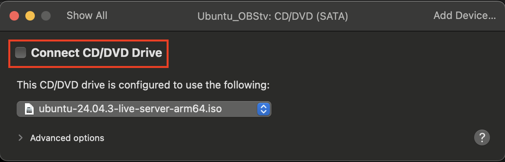

## Exercise 4 - Exploring the MXL plugin for OBS studio

### Synopsis

In order to have fun with the MXL OBS pluging, we will move away from WSL and go with a full Ubuntu VM. This will gives us the ability to have a graphical environment which is needed to play with OBS studio. Note that it is possible to do it in wsl with display forwarding, but I deemed it less complicated to give unified instruction over a VM. If you are familiar with display forwarding or you want to run it natively on your Mac, feel free to base yoursefl on the instruction below or directly from the OBS plugin repository.

## [OBS plugin repository](https://github.com/samisb/obs-mxl-plugin/blob/main/README.md)

### Installing Vmware Workstation Pro or Vmware Fusion (Now free for private and comercial use).

1. Register on the Broadcom website to acces free download.

1. Once logged in, use these links to access the free download area and download Vmware Workstation Pro or Vmware Fusion. 
    [Vmware Workstation Pro (Windows)](https://support.broadcom.com/group/ecx/productdownloads?subfamily=VMware%20Workstation%20Pro&freeDownloads=true). 
    [Vmware Fusion (MacOS)](https://support.broadcom.com/group/ecx/productdownloads?subfamily=VMware%20Fusion&freeDownloads=true).

1. Install the software. For lenght concern, I will not describe how to do the installation. It is a regular windows or MacOS installation.

1. Download the relevent Ubuntu ISO. 
    [Ubuntu Desktop 24.04.03 LTS amd64 for Windows or Intel Mac](https://ubuntu.com/download/desktop) 
    [Ubuntu Server 24.04.03 LTS arm for apple silicon Mac](https://ubuntu.com/download/server/arm)
1. Create a new VM using the default settings with the image you just downloaded.
    For Mac 
    
1. After the Linux install of you VM, you will need to disable the CDROM mount. Uncheck the *Connect CD/DVD Drive* and reboot your VM. You can also play with the allocated ressources depending on how much you have on your system, but default should be fine.
     
    
