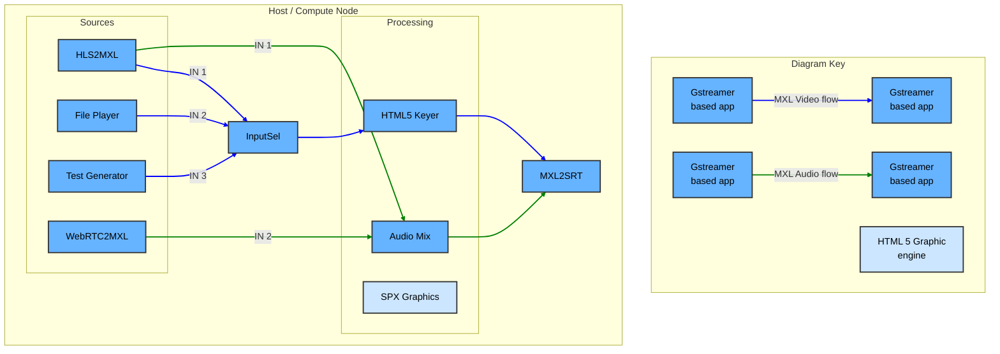

## Exercise 4 - Full open source DMF with Nmos support

### Synopsis

In this exercise, we will compile the latest commit of the MXL SDK including rust bindings and the rust Gstreamer plugins. Then we will build a full stream augmentation workflow supported by various open source project, including MediaMTX, CEF, **need to complete the full list**.



### Steps

1. Navigate to exercise 5 working directory
    ```sh
        cd ~/mxl-hands-on/docker/exercise-5
    ```
1. Start the system with the start script.
    ```sh
        ./start.sh # For linux based machine
    ```
    ```sh
        ./start-mac.sh # For mac based machine
    ```
1. Use the application and try to reproduce the workflow above. You have more documentation on application usage [here](../gst-apps/README.md)

| App | URL | API Swagger Page |
|-----|-----|-----|
| Test Generator | http://localhost:9600 | http://localhost:9600/docs |
| MXL Info GUI | http://localhost:9699 | http://localhost:9699/docs |
| MXL to WebRTC | http://localhost:9601 | http://localhost:9601/docs |


Reference HLS stream that are 1920x1080p60
    ```sh
        https://devstreaming-cdn.apple.com/videos/streaming/examples/img_bipbop_adv_example_fmp4/master.m3u8
    ```
    ```sh
        https://test-streams.mux.dev/x36xhzz/x36xhzz.m3u8
    ```