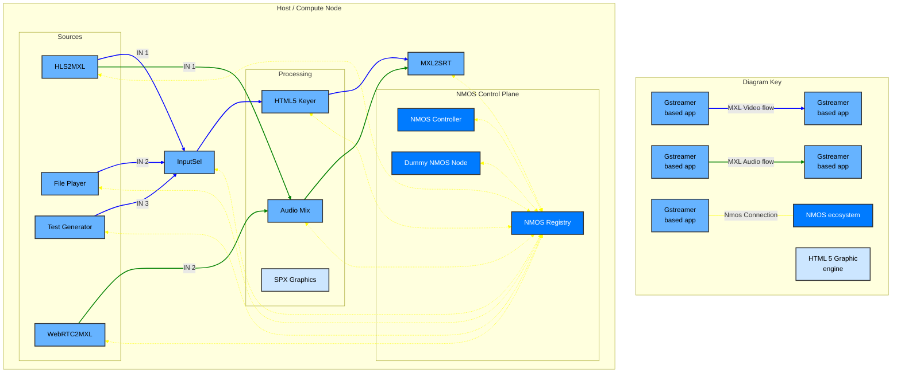

## Exercise 4 - Full open source DMF with Nmos support

### Synopsis

In this exercise, we will compile the latest commit of the MXL SDK including rust bindings and the rust Gstreamer plugins. Then we will build a full stream augmentation workflow supported by various open source project, including an Nmos repository.



### Steps

1. Update the submodule to latest commit of main branch (execute from the root of the repository).
    ```sh
        cd ~/mxl-hands-on/dmf-mxl
        git checkout main
        git pull origin main
        cd ..
    ```
1. Tell git to ignore any change to the submodule. This is only needed if you intent to publish back to the remote as we want to keep the remote on the official release hash, not the latest and we also want to ignore all the build artefact.
    ```sh
        git update-index --assume-unchanged dmf-mxl
    ```
1. Build the MXL SDK by running the build script.
    ```sh
        ./build_linux.sh
    ```
1. Navigate to the exercise 5 folder.
    ```sh
        cd ~/mxl-hands-on/docker/exercise-5
1. Build the rust image needed to compile the rust binding and Gstreamer plugins.
    ```sh
        UID=$(id -u) GID=$(id -g) docker compose -f docker-compose.rust-build.yml build
    ```
1. Use the image to build rust binding and Gstreamer plugins.
    ```sh
        UID=$(id -u) GID=$(id -g) docker compose -f docker-compose.rust-build.yml run --rm rust-build
    ```
1. Edit your terminal config file to add paths of Gstreamer plugins and MXL library so it is present on all terminal you open.
    **For .zshrc terminal**
    ```sh
        echo '' >> ~/.zshrc
        echo '# MXL environment' >> ~/.zshrc
        echo 'export GST_PLUGIN_PATH="$HOME/mxl-hands-on/dmf-mxl/rust/target/release"' >> ~/.zshrc
        echo 'export LD_LIBRARY_PATH="$HOME/mxl-hands-on/dmf-mxl/build/Linux-Clang-Release/lib:$HOME/mxl-hands-on/dmf-mxl/build/Linux-Clang-Release/lib/internal"' >> ~/.zshrc
        source ~/.zshrc
    ```
    **For .bashrc terminal**
    ```sh
        echo '' >> ~/.bashrc
        echo '# MXL environment' >> ~/.bashrc
        echo 'export GST_PLUGIN_PATH="$HOME/mxl-hands-on/dmf-mxl/rust/target/release"' >> ~/.bashrc
        echo 'export LD_LIBRARY_PATH="$HOME/mxl-hands-on/dmf-mxl/build/Linux-Clang-Release/lib:$HOME/mxl-hands-on/dmf-mxl/build/Linux-Clang-Release/lib/internal"' >> ~/.bashrc
        source ~/.bashrc
    ```
1. Create a symlink for the gstreamer plugin, Some function (dlopen()) have absolute path hardcoded.
    ```sh
        sudo mkdir -p /workspace/mxl/build/Linux-Clang-Release/lib
        sudo ln -sf /home/rochonma/mxl-hands-on/dmf-mxl/build/Linux-Clang-Release/lib/libmxl.so \
        /workspace/mxl/build/Linux-Clang-Release/lib/libmxl.so
    ```