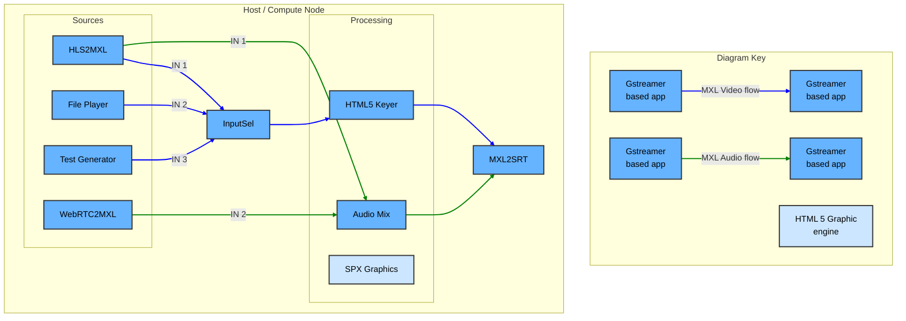

## Exercise 5 - Full open source DMF

### Synopsis

In this exercise, we will compile the latest commit of the MXL SDK including rust bindings and the rust Gstreamer plugins. Then we will build a full stream augmentation workflow supported by various open source project. A full list is found at the end of this document.



### Steps

1. Navigate to exercise 5 working directory
    ```sh
        cd ~/mxl-hands-on/docker/exercise-5
    ```
1. If you did **NOT** do the preparations steps for either WLS or MacOS, make sure you have a /Volumes/mxl mounted in *tmpfs* or *ram*.
   ```sh
   sudo mount -t tmpfs -o size=512m,uid=1000,gid=1000,mode=0755 tmpfs /Volumes/mxl # on WSL linux
   sudo mkdir -p /Volumes/mxl/domain_1
   sudo chown 1000:1000 /Volumes/mxl/domain_1
   ```
   ```sh
   diskutil erasevolume HFS+ mxl $(hdiutil attach -nomount ram://1048576) # on MacOS
   sudo mkdir -p /Volumes/mxl/domain_1
   sudo chown 1000:1000 /Volumes/mxl/domain_1
   ```
1. If you want to use the file player application, put your clip files (.ts or .mp4) in the ./data/Clips folder.
1. Start the system with the start script.
    ```sh
        ./start.sh # For linux based machine
    ```
    ```sh
        ./start-mac.sh # For mac based machine
    ```
1. Use the application and try to reproduce the workflow above. You have more documentation on application usage [here](../gst-apps/README.md)

| App | URL | API Swagger Page |
|-----|-----|-----|
| Test Generator | http://localhost:9600 | http://localhost:9600/docs |
| MXL Info GUI | http://localhost:9699 | http://localhost:9699/docs |
| MXL to WebRTC | http://localhost:9601 | http://localhost:9601/docs |
| File Player | http://localhost:9602 | http://localhost:9602/docs |


Reference HLS stream that are 1920x1080p60
    ```sh
        https://devstreaming-cdn.apple.com/videos/streaming/examples/img_bipbop_adv_example_fmp4/master.m3u8
    ```
    ```sh
        https://test-streams.mux.dev/x36xhzz/x36xhzz.m3u8
    ```

### Open Source Components

| Component | Category | License | Test Generator | MXL Info GUI | MXL2WebRTC |
|-----------|----------|---------|:--------------:|:------------:|:----------:|
| [React](https://github.com/facebook/react) | Frontend | MIT | ✓ | ✓ | ✓ |
| [React DOM](https://github.com/facebook/react) | Frontend | MIT | ✓ | ✓ | ✓ |
| [Vite](https://github.com/vitejs/vite) | Frontend | MIT | ✓ | ✓ | ✓ |
| [@vitejs/plugin-react](https://github.com/vitejs/vite-plugin-react) | Frontend | MIT | ✓ | ✓ | ✓ |
| [MXL](https://github.com/dmf-mxl/mxl) | Backend | Apache-2.0 | ✓ | ✓ | ✓ |
| [FastAPI](https://github.com/tiangolo/fastapi) | Backend | MIT | ✓ | ✓ | ✓ |
| [Uvicorn](https://github.com/encode/uvicorn) | Backend | BSD-3-Clause | ✓ | ✓ | ✓ |
| [aiofiles](https://github.com/Tinche/aiofiles) | Backend | Apache-2.0 | ✓ | ✓ | ✓ |
| [python-multipart](https://github.com/andrew-d/python-multipart) | Backend | Apache-2.0 | ✓ | ✓ | — |
| [Requests](https://github.com/psf/requests) | Backend | Apache-2.0 | ✓ | — | — |
| [Pydantic](https://github.com/pydantic/pydantic) | Backend | MIT | — | — | ✓ |
| [PyGObject](https://gitlab.gnome.org/GNOME/pygobject) | Runtime | LGPL-2.1+ | ✓ | — | ✓ |
| [GStreamer](https://gstreamer.freedesktop.org) | Runtime | LGPL-2.0+ | ✓ | — | ✓ |
| [GStreamer plugins-base](https://gstreamer.freedesktop.org/modules/gst-plugins-base.html) | Runtime | LGPL-2.0+ | ✓ | — | ✓ |
| [GStreamer plugins-good](https://gstreamer.freedesktop.org/modules/gst-plugins-good.html) | Runtime | LGPL-2.0+ | ✓ | — | ✓ |
| [GStreamer plugins-bad](https://gstreamer.freedesktop.org/modules/gst-plugins-bad.html) | Runtime | LGPL-2.0+ | ✓ | — | ✓ |
| [GStreamer plugins-ugly](https://gstreamer.freedesktop.org/modules/gst-plugins-ugly.html) | Runtime | LGPL-2.0+ | ✓ | — | ✓ |
| [GStreamer libav](https://gstreamer.freedesktop.org/modules/gst-libav.html) | Runtime | LGPL-2.0+ | ✓ | — | ✓ |
| [GStreamer nice (libnice)](https://libnice.freedesktop.org) | Runtime | LGPL-2.1 | — | — | ✓ |
| [MediaMTX](https://github.com/bluenviron/mediamtx) | Infrastructure | MIT | — | — | ✓ |
| [Ubuntu 24.04](https://ubuntu.com) | Base Image | Various | ✓ | ✓ | ✓ |
| [Node.js 18](https://nodejs.org) | Build | MIT | ✓ | ✓ | ✓ |