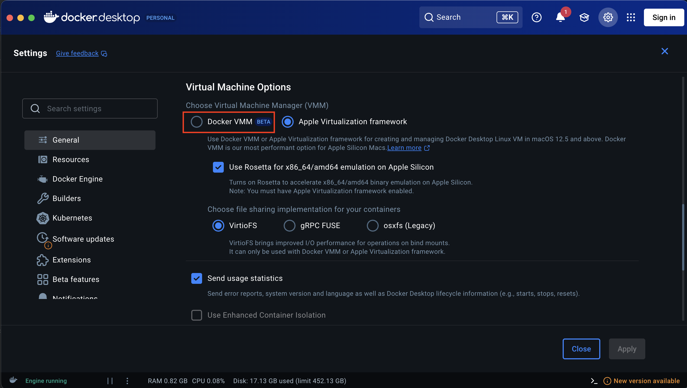

## Preparation - Installing Docker, Xcode Command Line Tools and creating a RamDisk

### Synopsis

In order to run these exercises on a Mac, you need to install Docker and create a RAM disk. Theses preparation steps will help you to install Docker and setup a RAM disk on your Mac.

### Installing Docker on MAC !!!DISCLAIMER, DOCKER DESKTOP IS A LICENSED PRODUCT, MAKE SURE YOU ARE FOLLOWING THE LICENSE!!!

### Steps

1. On MacOS with apple silicon it is recommended to install rosetta 2 to work with docker.
   ```sh
   softwareupdate --install-rosetta
   ```
1. Download the Docker.dmg file from the following link https://docs.docker.com/desktop/setup/install/mac-install/. Make sure to select the download link for the right type silicon your Mac is having.
   
1. Double click on the Docker.dmg file to mount it.
1. From the docker volume that just mounted on your desktop. Drag and drop the Docker.app in your Applications folder.
1. Open a terminal window.
1. Start Docker Desktop
   ```sh
   open -a Docker
   ```
1. Verify the Docker installation
   ```sh
   docker run hello-world
   ```
1. Our images are built for amd64 (Intel), so on Apple silicon Docker emulates them. Keep the default Docker Desktop settings: in Settings/General/Virtual Machine Options, select **Apple Virtualization framework** and enable **Use Rosetta for x86_64/amd64 emulation on Apple Silicon**.
1. Some user have reported they had issue using Rosetta with Docker Desktop. If you get an 'invalid instruction' message in your docker logs using our images, you can try to switch to VMM for the docker virtual machine manager in Settings/General/virtual Machine Options.

   > ⚠️ **Only switch to Docker VMM if you get that error.** Docker VMM can't use Rosetta, so it emulates amd64 with QEMU, which is much slower. On a test Mac, the Exercise 1 writer dropped from about 27 to about 18 frames per second (it should produce 29.97), so the latency shown by mxl-info grows by several seconds every minute.



### Installing Xcode Command Line Tools. This will come with git commands.

1. Installing Xcode Command Line Tools. After the CLI command accept the pop-up to install Xcode.
   ```sh
   xcode-select --install
   ```

### Installing Brew

1. Installing Brew, an optional package manager.
   ```sh
   /bin/bash -c "$(curl -fsSL https://raw.githubusercontent.com/Homebrew/install/HEAD/install.sh)"
   ```

1. ```sh
   brew install jq
   ```
### Creating a 512MB RamDisk on your MAC

### Steps

1. Create a 512MB ram disk
   ```sh
   diskutil erasevolume HFS+ mxl $(hdiutil attach -nomount ram://1048576)
   sudo mkdir -p /Volumes/mxl/domain_1
   sudo chown 1000:1000 /Volumes/mxl/domain_1
   ```
1. Verify that the disk was created
   ```sh
   diskutil list
   ```
1. The RAM disk disappears when you restart your Mac or eject it. Before each session, check that `/Volumes/mxl` is still the RAM disk: the size must be about 512M, not the size of your main disk. If it isn't, delete the leftover folder and create the RAM disk again with the step above. Otherwise `mkdir` creates the folders on your main disk, and the MXL writers can't write to them. If you skip the delete, macOS mounts the new RAM disk as `/Volumes/mxl 1`.
   ```sh
   df -h /Volumes/mxl
   ```
   ```sh
   sudo rm -r /Volumes/mxl # only if df shows your main disk
   ```
1. You are ready to go!!!

### [Back to main page](../README.md)