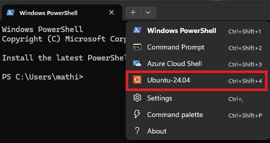

## Preparation - Installing WSL and Docker

### Synopsis

In order to run these exercises, you need a Linux base system running with Docker. Theses preparation steps will help you to install WSL (Windows Subsystem for Linux). If you already have access to a Linux system, you can skip to the second part to install Docker.

### Installing WSL on Windows 11

### Steps

1. Open an Admin Command Prompt or Powershell window.

1. Install WSL from the command prompt  
   ```sh
   wsl.exe -- install
   ```
1. List all the available linux distribution to be use with WSL
   ```sh
   wsl.exe --list --online
   ```
1. Reboot your PC
1. Alternatively to Alma Linux, CBC also support Ubuntu Linux as well.
   ```sh
   wsl.exe --install Ubuntu-24.04
   ```
1. After the distribution install, it should prompt for a default UNIX username and password. **Use the user username. This will make sure command in the exercises are working proprely**.
1. You will now be logged in your newly created user. We will exit back to the powershell command line.
   ```sh
   exit
   ```
1. Verify the installed WSL linux distribution
   ```sh
   wsl.exe --list --all
   ```
1. We will now open a terminal connected to our Ubuntu linux. There is an arrow down next to the plus sign of the of the powershell window. Click on it and select Ubuntu-24.04
   
   

1. Update your linux WSL instance
   ```sh
   sudo apt update && sudo apt upgrade
   ```

### Installing Docker and Git in your WSL Alma linux instance

### Steps

1. Add Docker's official GPG key
   ```sh
   sudo install -m 0755 -d /etc/apt/keyrings
   sudo curl -fsSL https://download.docker.com/linux/ubuntu/gpg -o /etc/apt/keyrings/docker.asc
   sudo chmod a+r /etc/apt/keyrings/docker.asc
   ```
1. Add the repository to Apt sources
   ```sh
   echo \
   "deb [arch=$(dpkg --print-architecture) signed-by=/etc/apt/keyrings/docker.asc] https://download.docker.com/linux/ubuntu \
   $(. /etc/os-release && echo "${UBUNTU_CODENAME:-$VERSION_CODENAME}") stable" | \
   sudo tee /etc/apt/sources.list.d/docker.list > /dev/null
   sudo apt-get update
   ```
1. Install the latest version of Docker
   ```sh
   sudo apt-get install docker-ce docker-ce-cli containerd.io docker-buildx-plugin docker-compose-plugin
   ```
1. Add your user to the docker group so that you can run docker command without using `sudo`
   ```sh
   sudo usermod -aG docker $USER
   newgrp docker
   ```
1. Verify the installation
   ```sh
   docker run hello-world
   ```

### Creating a folder that is mounted in *tmpfs*. By default, WSL 2 is mounting /tmp and /dev on disk, not on RAM. We need to create a Folder that is mounted in RAM in order for MXL to be able to share media through memory. **If you are not using WSL but a regular linux installation, you still need to do these steps. This is where the MXL writers and readers will put media in the next exercises.**

### Steps

1. Creating a folder for MXL media sharing.
   ```sh
   sudo mkdir /mxl
   ```
1. Creating a mount point in */etc/fstab* to mount */mxl* to *tmpfs*
   ```sh
   sudo touch /etc/fstab && sudo chmod 666 /etc/fstab && sudo echo 'tmpfs /mxl tmpfs defaults,noatime,size=512M 0 0' > /etc/fstab
   ```
1. Close your linux terminal windows. Using a Windows PowerShell shutdown you linux instance.
   ```sh
   wsl --shutdown
   ```
1. Restart your linux instance using the arrow down menu of the terminal window and verify that the */mxl* folder is mounted to *tmpfs*
   ```sh
   df -h /mxl
   ```
1. You are ready to go!!!

### [Back to main page](../README.md)