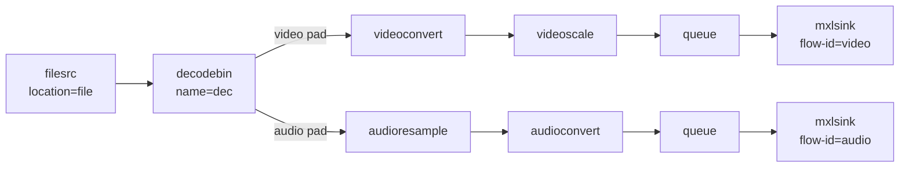
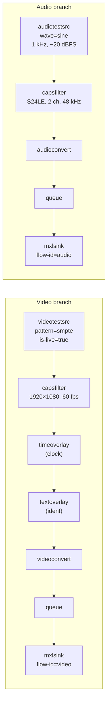
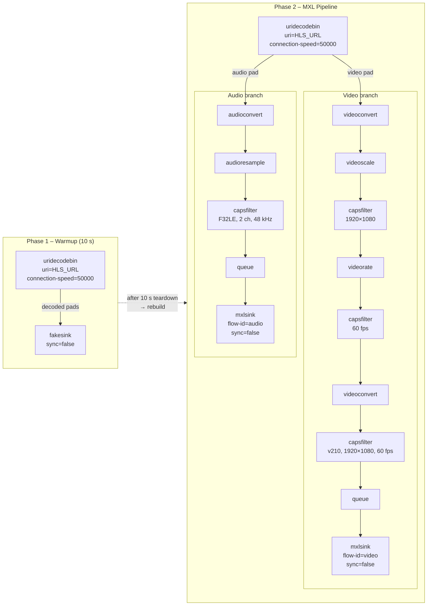
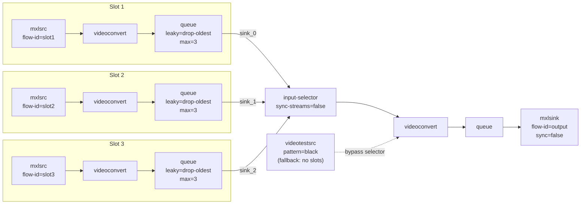
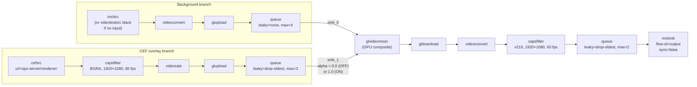
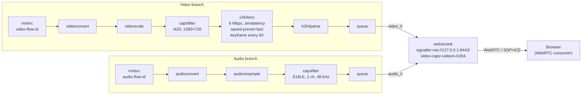

# Exercise 5 – GStreamer Pipelines Reference

Each section below describes one of the six GStreamer-based services, gives the equivalent
`gst-launch-1.0` command, explains what the pipeline does, and includes a Mermaid diagram.

---

## 1. File Player (`gst_player.py`)

### `gst-launch-1.0` command

```bash
gst-launch-1.0 \
  filesrc location="/path/to/media/file" \
  ! decodebin name=dec \
  dec. ! videoconvert ! videoscale ! queue \
       ! mxlsink flow-id="<video-flow-id>" domain="/mxl-domain" \
  dec. ! audioresample ! audioconvert ! queue \
       ! mxlsink flow-id="<audio-flow-id>" domain="/mxl-domain"
```

### Explanation

Reads a media file from disk and demuxes/decodes it with `decodebin`.
The decoded video stream is colour-converted and scaled before being written to an MXL flow
via `mxlsink`. The decoded audio stream is resampled and converted before being written to a
second MXL flow. Once the file reaches end-of-stream the pipeline seeks back to position 0 to
loop indefinitely.

The pipeline is first brought to `PAUSED` so that `mxlsink` has time to write `flow_def.json`,
then the label/description in that file is patched before playback starts.

### Diagram



---

## 2. Test Generator (`gst_generator.py`)

### `gst-launch-1.0` command

```bash
gst-launch-1.0 \
  videotestsrc pattern=0 is-live=true \
  ! "video/x-raw,width=1920,height=1080,framerate=60/1" \
  ! timeoverlay font-desc="Sans Bold 28" halignment=right valignment=bottom shaded-background=true \
  ! textoverlay text="<ident>" font-desc="Sans Bold 36" halignment=center valignment=top shaded-background=true \
  ! videoconvert ! queue \
  ! mxlsink flow-id="<video-flow-id>" domain="/mxl-domain" \
  audiotestsrc wave=0 freq=1000 volume=0.1 is-live=true \
  ! "audio/x-raw,format=S24LE,channels=2,rate=48000,layout=interleaved" \
  ! audioconvert ! queue \
  ! mxlsink flow-id="<audio-flow-id>" domain="/mxl-domain"
```

> **Note:** `volume=0.1` corresponds to the default level of −20 dBFS (`10^(−20/20) ≈ 0.1`).
> `wave=0` is a sine wave. `pattern=0` is the SMPTE colour bars.

### Explanation

Generates a live synthetic test signal — no file, no external source.

The **video branch** produces 1920×1080 @ 60 fps colour-bars (SMPTE by default).
A `timeoverlay` element burns the running clock into the bottom-right corner, and a
`textoverlay` element renders a configurable ident string at the top centre.
Both overlays can be toggled or updated at runtime without rebuilding the pipeline.

The **audio branch** produces a continuous 1 kHz sine wave at −20 dBFS, stereo, 48 kHz, 24-bit.
The channel count (2 or 6) and level (−60 … 0 dBFS) can be changed at runtime; changing the
channel count forces a pipeline rebuild because the `capsfilter` must change.

### Diagram



---

## 3. HLS-to-MXL Gateway (`gst_hls.py`)

### `gst-launch-1.0` commands

**Phase 1 – Warmup (10 s)**

```bash
gst-launch-1.0 \
  uridecodebin uri="<HLS_URL>" connection-speed=50000 \
  ! fakesink sync=false
```

**Phase 2 – Real MXL pipeline**

```bash
gst-launch-1.0 \
  uridecodebin uri="<HLS_URL>" connection-speed=50000 name=dec \
  dec. ! videoconvert ! videoscale \
       ! "video/x-raw,width=1920,height=1080" \
       ! videorate \
       ! "video/x-raw,framerate=60/1" \
       ! videoconvert \
       ! "video/x-raw,format=v210,width=1920,height=1080,framerate=60/1" \
       ! queue \
       ! mxlsink flow-id="<video-flow-id>" domain="/mxl-domain" sync=false \
  dec. ! audioconvert ! audioresample \
       ! "audio/x-raw,format=F32LE,channels=2,rate=48000,layout=interleaved" \
       ! queue \
       ! mxlsink flow-id="<audio-flow-id>" domain="/mxl-domain" sync=false
```

### Explanation

Ingests an HLS stream and republishes it as two MXL flows.

**Two-phase startup** avoids delivering a low-quality variant to MXL during adaptive-bitrate
stabilisation.  During the 10-second warmup, `uridecodebin` connects to the HLS manifest with
`connection-speed=50000` (kbps) to force the highest bitrate variant, but the decoded frames go
to `fakesink` — the MXL writers are not yet involved. After the warmup the stale MXL flow
directories are deleted, and the real pipeline is launched.

The **video branch** normalises the incoming frames to 1920×1080 (via `videoscale`) and
60 fps (via `videorate`), then locks the pixel format to v210 before writing to `mxlsink`.
The double `videoconvert` pattern ensures `videoscale` and `videorate` always have a compatible
intermediate format regardless of what the HLS variant delivers.

The **audio branch** converts to F32LE stereo 48 kHz — the format `mxlsink` requires for audio.

On any GStreamer error the pipeline automatically tears down, cleans up the flow directories, and
restarts the full warmup sequence after 2 seconds.

### Diagram



---

## 4. Input Selector (`gst_selector.py`)

### `gst-launch-1.0` command

**With connected slots (example with 3 inputs)**

```bash
gst-launch-1.0 \
  input-selector name=sel sync-streams=false \
  mxlsrc video-flow-id="<flow-id-1>" domain="/mxl-domain" \
       ! videoconvert ! queue leaky=1 max-size-buffers=3 ! sel.sink_0 \
  mxlsrc video-flow-id="<flow-id-2>" domain="/mxl-domain" \
       ! videoconvert ! queue leaky=1 max-size-buffers=3 ! sel.sink_1 \
  mxlsrc video-flow-id="<flow-id-3>" domain="/mxl-domain" \
       ! videoconvert ! queue leaky=1 max-size-buffers=3 ! sel.sink_2 \
  sel. ! videoconvert ! queue \
       ! mxlsink flow-id="<output-flow-id>" domain="/mxl-domain" sync=false
```

**When no input is connected (black output fallback)**

```bash
gst-launch-1.0 \
  videotestsrc pattern=2 is-live=true \
  ! videoconvert \
  ! mxlsink flow-id="<output-flow-id>" domain="/mxl-domain" sync=false
```

### Explanation

Implements a **2-step vision mixer switch**: a `select` call pre-arms the desired input,
and a `take` call atomically switches the output — matching the traditional on-air take paradigm.

Up to three `mxlsrc` sources (NMOS receivers, slots 1–3) feed an `input-selector` element.
Each branch has a small leaky queue (`leaky=1` drops the oldest frame on overflow) to decouple
the sources from the selector without building up latency.  The selector's single output feeds a
`videoconvert` and then `mxlsink`.

When no slot is connected the `input-selector` is bypassed entirely and a black
`videotestsrc` is linked directly to the output sink, keeping the MXL flow alive.
The pipeline is rebuilt whenever a slot is connected or disconnected; the active pad selection
is restored after each rebuild.

### Diagram



---

## 5. HTML5 Keyer (`gst_keyer.py`)

### `gst-launch-1.0` command

```bash
gst-launch-1.0 \
  glvideomixer name=mixer \
  mxlsrc video-flow-id="<input-flow-id>" domain="/mxl-domain" \
       ! videoconvert ! glupload \
       ! queue leaky=0 max-size-buffers=4 max-size-time=0 max-size-bytes=0 \
       ! mixer.sink_0 \
  cefsrc url="http://spx-server:5660/renderer/" \
       ! "video/x-raw,format=BGRA,width=1920,height=1080,framerate=60/1" \
       ! videorate ! glupload \
       ! queue leaky=2 max-size-buffers=2 max-size-time=0 max-size-bytes=0 \
       ! mixer.sink_1 \
  mixer. ! gldownload ! videoconvert \
       ! "video/x-raw,format=v210,width=1920,height=1080,framerate=60/1" \
       ! queue leaky=2 max-size-buffers=2 \
       ! mxlsink flow-id="<output-flow-id>" domain="/mxl-domain" sync=false
```

> **Key toggle:** adjust the `alpha` property on `mixer.sink_1` at runtime
> (`0.0` = key OFF, `1.0` = key ON) without rebuilding the pipeline.

### Explanation

Composites an HTML5 graphics overlay (rendered by a Chrome/CEF browser pointed at an SPX
graphics server) on top of a live MXL video background using GPU-accelerated mixing.

The **background branch** reads an MXL flow (or falls back to a black `videotestsrc` when no
receiver is connected), converts the frame format and uploads it to GPU memory via `glupload`.
A non-leaky queue (4 frames) absorbs any brief GPU jitter without dropping unique background frames.

The **CEF overlay branch** connects `cefsrc` to the SPX renderer URL which delivers the HTML5
graphic in BGRA format (alpha channel preserved for keying).  A `videorate` element guarantees
a steady 60 fps feed to the mixer even when the browser renders at a lower rate.  A leaky queue
(2 frames, drop-oldest) ensures the mixer always receives the most recent graphic frame.

`glvideomixer` composites the two GPU textures.  Toggling the key simply sets the `alpha`
property on `sink_1` (the CEF pad) between `0.0` and `1.0` — no pipeline rebuild needed.

The output is downloaded from GPU, converted to v210, and written to `mxlsink`.
The pipeline is only rebuilt when the MXL receiver connection changes.

### Diagram



---

## 6. MXL-to-WebRTC (`gst_mxl2webrtc.py`)

### `gst-launch-1.0` command

```bash
gst-launch-1.0 \
  webrtcsink name=ws \
  mxlsrc video-flow-id="<video-flow-id>" domain="/mxl-domain" \
       ! videoconvert ! videoscale \
       ! "video/x-raw,format=I420,width=1280,height=720" \
       ! x264enc tune=4 speed-preset=5 bitrate=6000 key-int-max=60 \
       ! h264parse ! queue \
       ! ws.video_0 \
  mxlsrc audio-flow-id="<audio-flow-id>" domain="/mxl-domain" \
       ! audioconvert ! audioresample \
       ! "audio/x-raw,format=S16LE,channels=2,rate=48000,layout=interleaved" \
       ! queue \
       ! ws.audio_0
```

> **Signaller:** the `webrtcsink` signaller URI is set to `ws://127.0.0.1:8443/` at runtime
> (not expressible as a `gst-launch` property; requires the element API).
> `tune=4` is the `zerolatency` flag bitmask for x264enc.

### Explanation

Transcodes two MXL flows (video + audio) and delivers them to WebRTC consumers via a
local signalling server.

The **video branch** reads the MXL video flow, scales it down from 1080p to 720p (1280×720)
to reduce bandwidth, and encodes it with `x264enc` using the `zerolatency` tune for minimum
latency, a `fast` speed preset for balanced quality/CPU, 6 Mbps target bitrate, and a keyframe
every 60 frames (1 second at 60 fps).  `h264parse` re-frames the bitstream into a form
`webrtcsink` can consume.

The **audio branch** converts the MXL audio to S16LE stereo 48 kHz — the standard PCM format
expected by WebRTC before Opus encoding inside `webrtcsink`.

`webrtcsink` handles SDP negotiation, ICE, DTLS-SRTP, and RTP packetisation internally.
It accepts pre-encoded H.264 video (declared via `video-caps`) so the bitstream from `x264enc`
is passed through without re-encoding.

A generation counter guards against stale bus-error callbacks after a pipeline rebuild.
Transient startup errors trigger up to 3 automatic retries (2 s apart) to handle `mxlsrc`
ring-buffer availability races.

### Diagram


