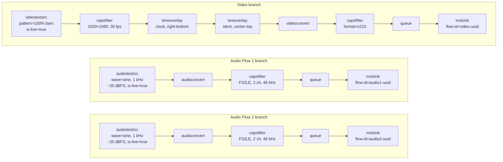
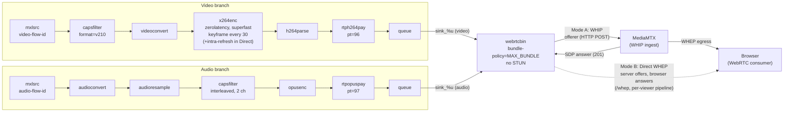
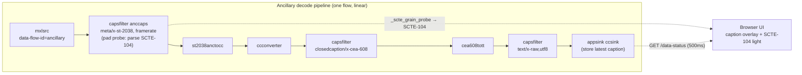
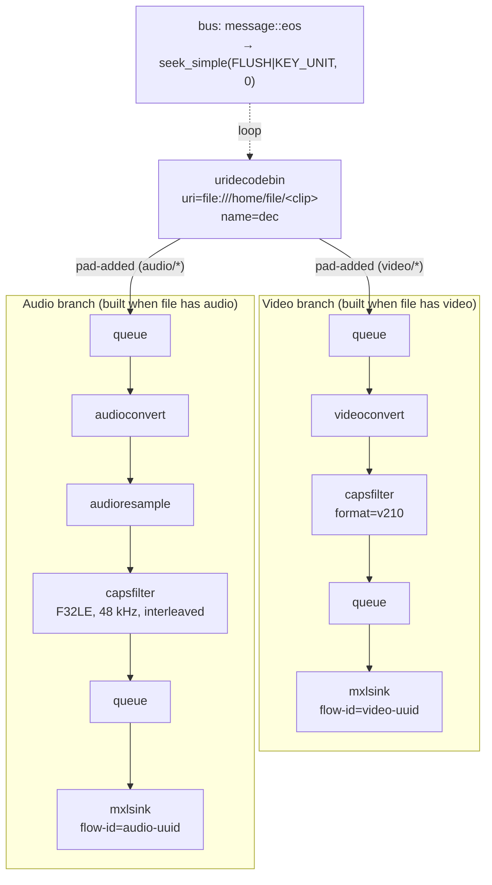
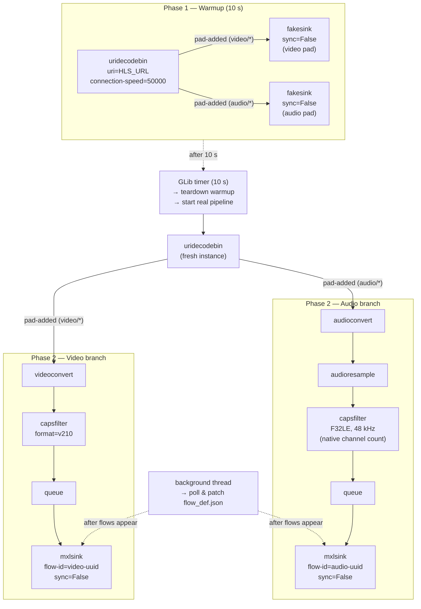
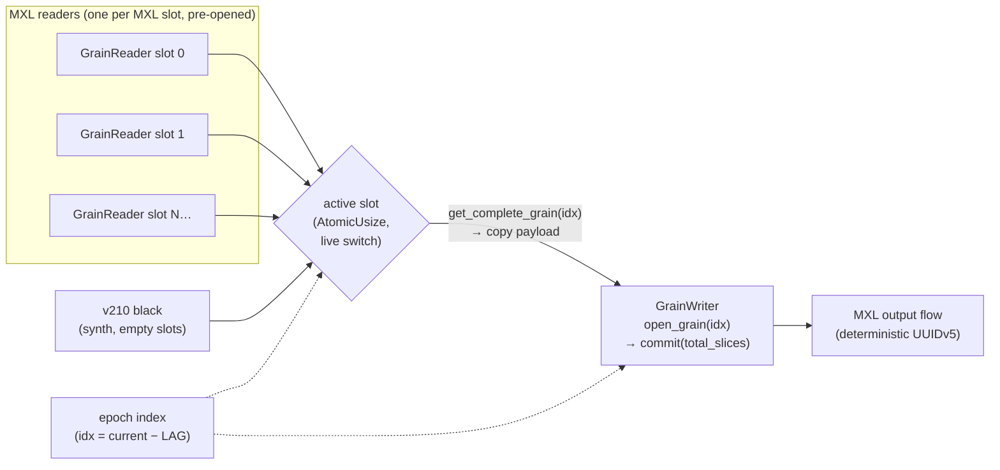

```mermaid
flowchart LR
    subgraph harvest["Harvest pipeline (separate)"]
        ccsrc["appsrc\ntext/x-raw,utf8\n(one ≤32-char row / 2s, cycling;\nblank row when idle)"]
        cc608["tttocea608\nmode=pop-on"]
        ccconv["ccconverter"]
        cccaps["capsfilter\nclosedcaption/x-cea-608"]
        ccanc["cctost2038anc"]
        ccanccaps["capsfilter\nmeta/x-st-2038"]
        ccsink["appsink (ccsink)\nbursts ~CAPTION_PUSH_MS of grains"]
        ccsrc --> cc608 --> ccconv --> cccaps --> ccanc --> ccanccaps --> ccsink
    end
    ccsink -->|"_on_caption_to_anc: append bytes"| fifo["_anc_fifo\n(bounded, leaky)"]
    fifo -->|"_anc_playout thread\n1 grain/frame (+SCTE on trigger)"| ancsrc
    subgraph output["Output pipeline (separate)"]
        ancsrc["appsrc (ancsrc)\nmonotonic PTS"]
        ancq["queue"]
        ancsink["mxlsink\nflow-id=ancillary-uuid"]
        ancsrc --> ancq --> ancsink
    end
```

```mermaid
flowchart LR
    subgraph bg_branch["Background branch"]
        bg["mxlsrc\nvideo-flow-id=input\ndomain=/mxl-domain"]
        bg_conv["videoconvert\nv210 → BGRA"]
        bg_caps["capsfilter\nformat=BGRA"]
        bg_q["queue\nleaky=drop-oldest, max=2"]
        bg --> bg_conv --> bg_caps --> bg_q
    end

    subgraph cef_branch["CEF overlay branch"]
        cef["cefsrc\nurl=http://host.docker.internal:…"]
        cef_caps1["capsfilter\nBGRA, W×H, integer fps"]
        cef_rate["videorate"]
        cef_caps2["capsfilter\nBGRA, num/den fps"]
        cef_q["queue\nleaky=drop-oldest, max=2"]
        cef --> cef_caps1 --> cef_rate --> cef_caps2 --> cef_q
    end

    mixer["compositor\nignore-inactive-pads NOT set\n(waits for CEF; CPU composite)"]
    pts_fix["identity\nsignal-handoffs=true\n(add base_time to PTS)"]
    out_conv["videoconvert\nBGRA → v210"]
    out_caps["capsfilter\nv210, W×H, num/den\ncolorimetry=bt709"]
    out_q["queue\nleaky=drop-oldest, max=2"]
    out_sink["mxlsink\nflow-id=output\nsync=false"]

    bg_q   -->|"sink_0\nzorder=0"| mixer
    cef_q  -->|"sink_1\nsync=false\nzorder=1\nalpha=0.0→1.0"| mixer

    mixer --> pts_fix --> out_conv --> out_caps --> out_q --> out_sink
```

# Exercise 5 – GStreamer Pipelines Reference

Each section below describes one of the six GStreamer-based services, gives the equivalent
`gst-launch-1.0` command, explains what the pipeline does, and includes a Mermaid diagram.


---

## 1. Test Generator (`gst_generator.py`)

### `gst-launch-1.0` command

```bash
gst-launch-1.0 \
  videotestsrc pattern=19 is-live=true \
    ! "video/x-raw,width=1920,height=1080,framerate=30/1" \
    ! timeoverlay font-desc="Sans Bold 28" halignment=right valignment=bottom shaded-background=true \
    ! textoverlay text="Test Generator" font-desc="Sans Bold 36" halignment=center valignment=top shaded-background=true \
    ! videoconvert \
    ! "video/x-raw,format=v210" \
    ! queue \
    ! mxlsink flow-id="<video-uuid>" domain="/mxl-domain/<domain-uuid>.mxl-domain" \
  audiotestsrc wave=0 freq=1000 volume=0.1 is-live=true \
    ! audioconvert \
    ! "audio/x-raw,format=F32LE,channels=2,rate=48000,layout=interleaved" \
    ! queue \
    ! mxlsink flow-id="<audio1-uuid>" domain="/mxl-domain/<domain-uuid>.mxl-domain" \
  audiotestsrc wave=0 freq=1000 volume=0.1 is-live=true \
    ! audioconvert \
    ! "audio/x-raw,format=F32LE,channels=2,rate=48000,layout=interleaved" \
    ! queue \
    ! mxlsink flow-id="<audio2-uuid>" domain="/mxl-domain/<domain-uuid>.mxl-domain"
```

> **Note:** `volume=0.1` ≈ −20 dBFS (`10^(−20/20)`). `wave=0` is a sine wave.
> `pattern=19` is the 100% colour bars (SMPTE full-range). Flow UUIDs are **deterministic
> (UUID v5)** derived from the group hint — restarting with the same group hint reuses the
> same UUIDs; changing the group hint produces a different set.

### Explanation

Generates three independent live test flows — one video and two audio — with no external
source. The pipeline is user-controlled: the UI's **Setup** section configures domain, raster,
frame rate, and per-flow metadata; the pipeline only starts when the user clicks **Start**.

**Video branch** — `videotestsrc → capsfilter(res+fps) → timeoverlay → textoverlay
→ videoconvert → capsfilter(v210) → queue → mxlsink`

`videotestsrc` generates synthetic colour-bar frames at the selected raster
(1280×720, 1920×1080, or 3840×2160) and frame rate (24/25/29.97/30/50/59.94/60 fps).
A `timeoverlay` burns the running pipeline clock into the bottom-right corner; a
`textoverlay` overlays a configurable ident string at the top centre.
Both overlays are live-adjustable (no pipeline rebuild required).
`videoconvert` is mandatory before the v210 capsfilter: `timeoverlay` and `textoverlay`
work in AYUV or I420 internally, and `videoconvert` translates that into the packed v210
format that `mxlsink` requires. Without this explicit capsfilter, auto-negotiation may
land on an incompatible pixel format and cause a hard runtime failure.

**Audio Flow 1 and Audio Flow 2** — each independently:
`audiotestsrc → audioconvert → capsfilter(F32LE, N ch, 48 kHz) → queue → mxlsink`

Each branch has its own `audiotestsrc` (independently configurable wave, level) feeding
its own `mxlsink` through its own UUID — the two flows are completely independent.
`audiotestsrc` natively produces float samples at whatever rate and channel count the
downstream capsfilter negotiates; `audioconvert` is present to handle any intermediate
format differences and to make the negotiation chain explicit.
The final capsfilter locks the format to `F32LE` interleaved, which is the only audio
format `mxlsink` accepts. Channel count (1–64) is configured per flow in the Setup
section before the pipeline starts and is fixed for its lifetime — it cannot be changed
without a Stop + Start because caps renegotiation across a running mxlsink is not
reliable. Audio level (−60 … 0 dBFS in 0.5 dB steps) is adjustable live.

The pipeline is brought directly to `PLAYING` state. A background thread then polls for
each flow's `{domain}/{uuid}.mxl-flow/flow_def.json` (up to 15 s) and patches the
`grouphint`, `description`, and `label` fields with the values entered in the Setup form.

### Diagram



### Ancillary data — Closed Captions + SCTE-104 on one flow (optional, separate pipelines)

When the user enables the **Ancillary Data** flow, the generator carries captions and SCTE-104 on one
`video/smpte291` flow using **two GStreamer pipelines bridged in Python** (both separate from A/V) plus
a **frame-paced playout thread**: a *harvest* pipeline encodes the captions to ST 2038 ANC, a callback
queues those grains, and the playout thread reclocks them to frame rate while **appending a SCTE-104
ANC packet to one grain** when the operator triggers.

```bash
# harvest pipeline — encodes captions to ST 2038 ANC, delivered to an appsink (ccsink)
gst-launch-1.0 \
  appsrc is-live=true do-timestamp=false format=time caps="text/x-raw,format=utf8" \
    ! tttocea608 mode=pop-on ! ccconverter ! "closedcaption/x-cea-608,framerate=30000/1001" \
    ! cctost2038anc ! "meta/x-st-2038,alignment=frame,framerate=30000/1001" \
    ! appsink name=ccsink sync=false

# output pipeline — the playout thread pushes one grain/frame here (SCTE appended on trigger)
gst-launch-1.0 \
  appsrc name=ancsrc is-live=true do-timestamp=false format=time \
         caps="meta/x-st-2038,alignment=frame,framerate=30000/1001" \
    ! queue ! mxlsink flow-id="<ancillary-uuid>" domain="/mxl-domain/<domain-uuid>.mxl-domain"
#   Python bridge: ccsink → _anc_fifo (bounded) → _anc_playout thread (1 grain/frame) → ancsrc
```

> The flow UUID is deterministic UUID v5 with role `:Ancillary Data`.

#### Explanation

**Why separate pipelines (the key design point).** The caption/output branches are `appsrc`-fed and
**manually timestamped**. If they share the A/V pipeline, their startup disturbs the shared pipeline
clock/base-time, and the video/audio `mxlsink`s latch a wrong *first-buffer* time offset — every
flow then writes grains at the 1970 epoch (mxl-info shows latency ≈ today's Unix time, "~56
years"). Giving the ancillary data its **own** pipelines keeps the A/V pipeline byte-for-byte the
original, working one. The backend sets them PLAYING and starts the push timer + playout thread
**without blocking** on `get_state()` (they need the instance lock that `start()` holds, so blocking
would stall preroll and again push the first grain to the epoch).

**Caption chain (harvest)** — `appsrc(text/x-raw,utf8) → tttocea608 mode=pop-on → ccconverter
→ capsfilter(closedcaption/x-cea-608,framerate) → cctost2038anc
→ capsfilter(meta/x-st-2038,alignment=frame,framerate) → appsink(ccsink)`.
The caption text is **word-wrapped into ≤32-character rows** (CEA-608's hard per-row limit — this
is why long lines were previously clipped) and a GLib timer pushes **one row every 2 s**
(`CAPTION_PUSH_MS`), cycling/wrapping the index so the rows scroll and the message repeats. When there
is no caption text it pushes a **blank row** so the flow keeps producing per-frame CC ANC grains.
`tttocea608` emits each row's per-frame grains in an instant **burst**. **Pop-on** is used rather than
roll-up: pop-on loads each caption off-screen and flips it complete, so a single ≤32-char chunk
round-trips cleanly, whereas roll-up smears ~2 characters at each carriage-return boundary (e.g.
`"to check"` → `"toheck"`). The 2 s cadence must stay above the row's CEA-608 transmit time (~16
frames for 32 chars at 2 chars/frame).

**Frame-paced playout + SCTE-104 injection.** `ccsink`'s callback (`_on_caption_to_anc`) appends each
harvested grain's bytes to a bounded FIFO (`_anc_fifo`). A daemon thread (`_anc_playout`) pops **one
grain per frame** at a monotonic cadence, gives it a fresh monotonic PTS, and pushes it to `ancsrc`;
`mxlsink` then commits it to the ring. On a trigger it **appends one conformant SCTE-104 ANC packet**
(DID `0x41` / SDID `0x07`, SMPTE ST 2010; `multiple_operation_message` with one `splice_request_data`
op, opID `0x0101`, incrementing `splice_event_id`) to the **single grain** emitted at that moment
(`_scte_pending_event_id`, one-shot). ST 2038 ANC packets are byte-aligned, so the concatenation is a
valid multi-ANC grain that `mxlsink` and the consumer both parse. Because the playout runs at frame
rate, the marker lands within **~1 frame of the trigger** (measured trigger→consumer-detect a few tens
of ms), instead of waiting for the next ~`CAPTION_PUSH_MS` harvest burst (~1 s avg). A startup cushion
of one burst (`_anc_cushion = frames`) keeps the FIFO from underflowing at the trough; on a rare
underflow the last grain is repeated and PTS still advances, so `mxlsink` never ratchets latency.
**Tradeoff:** the cushion adds ~`CAPTION_PUSH_MS` (~2 s) latency to caption *display* (not to the SCTE
event, which is what's optimised).

**Why this shape (dead ends, do not retry).** `st2038ancmux` (muxing a caption leg + a per-frame SCTE
leg) produced jittery latency (grains 0–35 ahead, cycling) and undecodable grains. A single combined
pipeline, and an in-flight pad-probe edit, both failed (epoch grains / PyGObject can't rewrite an
in-flight buffer). Pacing the harvest with `appsink sync=true` does **not** de-burst this chain
(`tttocea608`'s output timestamps don't gate the sink), so it kept the ~1 s SCTE latency. The
explicit frame-paced playout thread reclocks the FIFO with no dependency on GStreamer clock sync.

#### Diagram



---

## 2. MXL-to-WebRTC (`gst_mxl2webrtc.py`)

### `gst-launch-1.0` command

```bash
gst-launch-1.0 \
  webrtcbin name=wb bundle-policy=3 stun-server="" \
  mxlsrc video-flow-id="<video-flow-id>" domain="/mxl-domain" \
       ! "video/x-raw,format=v210" \
       ! videoconvert \
       ! x264enc tune=4 speed-preset=2 key-int-max=30 \
       ! h264parse \
       ! rtph264pay pt=96 config-interval=-1 \
       ! "application/x-rtp,media=video,encoding-name=H264,payload=96" \
       ! queue \
       ! wb.sink_%u \
  mxlsrc audio-flow-id="<audio-flow-id>" domain="/mxl-domain" \
       ! audioconvert ! audioresample \
       ! "audio/x-raw,layout=interleaved,channels=2" \
       ! opusenc \
       ! rtpopuspay pt=97 \
       ! queue \
       ! wb.sink_%u
```

> **Signalling:** the SDP offer/answer exchange is handled entirely by the Python code and
> cannot be expressed in a `gst-launch` command (see "Delivery modes" below).
> `bundle-policy=3` is `MAX_BUNDLE`. `tune=4` is the `zerolatency` bitmask for x264enc.
> `speed-preset=2` is `superfast`. In **Direct** mode the encoder is also given
> `intra-refresh=true` (no big periodic IDR keyframes — smoother low latency).

### Explanation

Transcodes two MXL flows (video + audio) and packages them as RTP for WebRTC. The same
encode chain feeds one of **two delivery modes**, selected at start time (`use_mediamtx`).

The **video branch** reads the MXL video flow as v210 and converts it to a format
`x264enc` accepts.  The encoder is tuned for minimum latency (`zerolatency`) and high
speed (`superfast`, `speed-preset=2`), with a keyframe every 30 frames.  `h264parse`
normalises the bitstream, and `rtph264pay` wraps it in RTP at payload type 96.

The **audio branch** reads the MXL audio, converts and resamples it, downmixes to stereo
(2 channels — the reliable maximum for Opus), encodes to Opus, and wraps the result in RTP
via `rtpopuspay` at payload type 97. The `capsfilter(channels=2)` is placed **after**
`audioconvert` and `audioresample` so those elements can negotiate the downmix; placing it
directly after `mxlsrc` causes an "Internal data stream error" when the source has more
than 2 channels.

Both RTP streams are fed into **`webrtcbin`** with `bundle-policy=MAX_BUNDLE` (single
transport for both media). No STUN server is configured — host ICE candidates are
sufficient. In **Direct** mode the host candidate's address is rewritten to the host the
browser connected to (the `POST /whep` `Host` header), so one bridged compose serves both
local and remote viewers; in **MediaMTX** mode the host-networked `mediamtx` service
handles browser reachability.

#### Mode A — MediaMTX relay (`use_mediamtx=true`, default)

A single pipeline pushes to a **MediaMTX** server via **WHIP** (WebRTC HTTP Ingest); the
browser plays from MediaMTX via **WHEP** (WebRTC HTTP Egress). The handshake is
Python-managed:
1. `webrtcbin` fires `on-negotiation-needed` → Python calls `create-offer`.
2. Python sets the local description and waits up to 10 s for ICE gathering to complete.
3. The gathered SDP offer is HTTP POST'd to the MediaMTX WHIP endpoint
   (`MEDIAMTX_WHIP_URL`, default `http://localhost:8889/mxl2webrtc/whip`).
4. MediaMTX responds with a 201 and an SDP answer; Python calls `set-remote-description`.

Most compatible (works on Docker Desktop), but MediaMTX forwards RTP without requesting
keyframes, so it **cannot carry intra-refresh** — hence intra-refresh is off in this mode.

#### Mode B — Direct WHEP (`use_mediamtx=false`)

No MediaMTX: the FastAPI app is its own signalling + media server, and **each viewer gets
its own complete `mxlsrc → encode → webrtcbin` pipeline** (built NULL→PLAYING as a unit,
the same lifecycle as Mode A — adding a `webrtcbin` to an already-running pipeline does not
initialise its ICE agent correctly). Signalling is **server-offers**:
1. `POST /whep` builds the pipeline; `webrtcbin` creates the **offer** (via
   `on-negotiation-needed`, so the offer carries the negotiated H.264/Opus media). The app
   returns it with a `Location: /whep/{id}`.
2. The browser sets it as its remote, creates an **answer**, and `POST`s it to the Location;
   the app applies it with `set-remote-description`. `DELETE /whep/{id}` tears the viewer down.

`webrtcbin` as the **offerer** reliably negotiates H.264; as a sendonly *answerer* it
mis-negotiates (`a=inactive` / wrong codec), which is why the browser answers here. This
path keeps the browser↔webrtcbin PLI loop intact, so **intra-refresh works**, latency is
lowest (no relay hop), and multiple simultaneous viewers are supported.

### Diagram



### Ancillary data — Caption decode & SCTE-104 parse (optional, one flow)

If the user selects an **Ancillary Data** flow, the app builds **one side pipeline** (shared by
all viewers, independent of the WebRTC delivery mode) that decodes the single `video/smpte291`
flow carrying both caption ANC and SCTE-104 ANC. It is **one linear caption pipeline** plus a
**pad probe** for SCTE — *not* a `tee` (a tee with a second branch stalled `cea608tott` and
blocked all decode). Assembled with `Gst.parse_launch` (delayed pad linking — see Explanation).

```bash
gst-launch-1.0 \
  mxlsrc data-flow-id="<ancillary-flow-id>" domain="/mxl-domain/<domain>" \
    ! "meta/x-st-2038,alignment=frame,framerate=30/1" name=anccaps \
    ! st2038anctocc ! ccconverter ! "closedcaption/x-cea-608" \
    ! cea608tott ! "text/x-raw,format=utf8" \
    ! appsink name=ccsink emit-signals=true sync=false
#   plus: a Gst.PadProbeType.BUFFER probe on the anccaps src pad (_scte_grain_probe)
#         reads each raw grain and parses the ANC for SCTE-104
```

> The `framerate` in the capsfilter is read from the flow's `flow_def.json` `grain_rate`.

#### Explanation

This runs regardless of the WebRTC mode (stored in `self._data_pipelines`); any error is
surfaced through `GET /data-status`.

**One linear pipeline + a pad probe, not a tee.** A `tee` feeding a second appsink branch stalled
`cea608tott` and blocked all caption decode. Instead the SCTE-104 detection rides a
`Gst.PadProbeType.BUFFER` probe on the `anccaps` src pad (`_scte_grain_probe`), which reads each
raw grain (read-only map) with no second branch.

**Build with `Gst.parse_launch`, not programmatic linking.** `st2038anctocc → ccconverter`
negotiate caps dynamically; a static `Element.link()` fails (`Failed to link st2038anctocc →
ccconv`) even though the same chain works under `gst-launch`. `parse_launch` performs the
delayed pad linking that handles this.

**mxlsrc needs a downstream `framerate`.** `mxlsrc`'s data src-pad template carries no
framerate and its `set_caps` errors without one, so the pipeline pins
`meta/x-st-2038,alignment=frame,framerate=<num>/<den>`, with the rate read from the producer's
`flow_def.json` (`grain_rate`).

**Caption decode (ccsink)** — `st2038anctocc → ccconverter → closedcaption/x-cea-608
→ cea608tott → text/x-raw,utf8 → appsink`. The callback stores the latest decoded text + a
timestamp (ignoring the producer's blank keep-alive rows). `st2038anctocc` extracts only the
caption ANC and ignores the SCTE ANC. The frontend polls `GET /data-status` (500 ms) and renders
a rolling 3-line overlay (handling both single-row and joined multi-row `cea608tott` output).

**SCTE-104 parse (`_scte_grain_probe`)** — the muxed flow carries caption ANC **every** frame, so
"non-empty grain" is no longer a trigger. The probe parses the ST 2038 ANC packets
(`parse_st2038_packets`), finds the SCTE-104 packet (DID `0x41` / SDID `0x07`), and decodes the
SCTE-104 `multiple_operation_message` (`parse_scte104` → `opID`, `splice_event_id`,
`splice_insert_type`). The producer marks **one grain per trigger**, so the 1 s debounce is only
defensive (not burst-coalescing); the UI lights an indicator for 5 s with the event time (ms) and
the decoded `splice_event_id`. With the producer's frame-paced playout, the consumer-detected
timestamp now tracks the trigger to within a few tens of ms.

#### Diagram



---

## 3. File Player (`gst_player.py`)

### `gst-launch-1.0` command

```bash
gst-launch-1.0 \
  uridecodebin uri="file:///home/file/<clip>" name=dec \
  dec. ! queue ! videoconvert \
       ! "video/x-raw,format=v210" \
       ! queue \
       ! mxlsink flow-id="<video-uuid>" domain="/mxl-domain/<domain-uuid>.mxl-domain" \
  dec. ! queue ! audioconvert ! audioresample \
       ! "audio/x-raw,format=F32LE,layout=interleaved,rate=48000" \
       ! queue \
       ! mxlsink flow-id="<audio-uuid>" domain="/mxl-domain/<domain-uuid>.mxl-domain"
```

> **Note:** Flow UUIDs are **deterministic (UUID v5)** derived from the group hint
> (e.g. `Clip-Player:video`, `Clip-Player:audio`) — restarting with the same group hint
> reuses the same UUIDs and overwrites the existing flow files in the domain.
> Looping (seek-on-EOS) cannot be expressed in a `gst-launch` command and is implemented
> in Python on the bus watch.

### Explanation

Reads a local media file (`.ts` or `.mp4`, any resolution/frame rate) from `/home/file` and
republishes it as one or two MXL flows. The pipeline is user-controlled: the UI's **Setup**
section configures domain, group hint, file, and per-flow metadata; the pipeline only starts
when the user clicks **Start**.

**Source/decode** — `uridecodebin` is used in preference to a fixed demuxer + decoder pair
because the container and codecs are not known up-front: `.ts` files carry MPEG-TS with
H.264 or H.265, `.mp4` files carry ISO BMFF with the same, and the same UI must accept all
of them. `uridecodebin` inspects the file, picks the right demuxer + parser + decoder, and
exposes ready-to-consume raw video/audio pads via the `pad-added` signal. The backend probes
the file beforehand (`GstPbutils.Discoverer`) so it knows which branches to build, but the
actual pad-to-branch wiring happens dynamically at runtime once the pads appear.

**Dynamic pad linking** — the video and audio branches are pre-built (each ends at an
`mxlsink`) and their head queues' sink pads are held aside. When `uridecodebin` emits
`pad-added`, the new pad's caps are inspected: `video/*` pads are linked to the video branch
head, `audio/*` pads to the audio branch head. Pads for which no active branch was created
(e.g. audio pads on a video-only configuration) are ignored. This makes the pipeline
work uniformly for video-only, audio-only, and audio+video files.

**Video branch** — `queue → videoconvert → capsfilter(v210) → queue → mxlsink`
`videoconvert` is mandatory because the decoded video can arrive in many pixel formats
(I420, NV12, P010, …) depending on the source codec, and `mxlsink` only accepts the packed
10-bit `v210` format. The explicit `capsfilter` locks the negotiation to `v210`; without it
auto-negotiation may land on whatever the upstream prefers and cause a hard runtime failure.

**Audio branch** — `queue → audioconvert → audioresample → capsfilter(F32LE @ 48 kHz interleaved) → queue → mxlsink`
`audioconvert` handles sample-format conversion (the decoded audio is typically S16/S32 LE,
not float), `audioresample` rebinds the rate to 48 kHz regardless of the source rate
(44.1 kHz, 32 kHz, etc.), and the `capsfilter` locks the format to `F32LE` interleaved —
the only audio format `mxlsink` accepts. Channel count is whatever the source file provides.

**Looping** — playback runs continuously. A `message::eos` handler on the pipeline bus
catches end-of-stream and immediately issues a flushing key-unit seek to position 0:

```python
pipeline.seek_simple(Gst.Format.TIME,
                     Gst.SeekFlags.FLUSH | Gst.SeekFlags.KEY_UNIT, 0)
```

This restarts the file from the beginning without rebuilding the pipeline, so the MXL
flows remain alive across loops and consumers see a single continuous stream.

**Flow_def.json patching** — once the pipeline reaches PLAYING, a background thread polls
each `{domain}/{flow-uuid}.mxl-flow/flow_def.json` (up to 15 s) and patches `grouphint`,
`tags["urn:x-nmos:tag:grouphint/v1.0"]`, `description`, and `label` with the values entered
in the Setup form (`<grouphint>:Video` and `<grouphint>:Audio` respectively).

### Diagram



---

## 4. HLS-to-MXL Gateway (`gst_hls2mxl.py`)

### `gst-launch-1.0` commands

**Phase 1 — Warmup (10 s, not shown — one fakesink per decoded pad, sync=false)**

> This phase uses a throw-away pipeline. There is no meaningful `gst-launch-1.0` equivalent
> because it creates fakesinks dynamically for every decoded pad via `pad-added`.

**Phase 2 — Real pipeline (after warmup)**

> **Note:** `gst-launch-1.0` cannot reproduce the dynamic `pad-added` wiring from
> `uridecodebin`. The command below shows the static equivalent; the actual Python
> implementation connects the pads dynamically at runtime.

```bash
gst-launch-1.0 \
  uridecodebin uri="<HLS_URL>" connection-speed=50000 name=dec \
  dec. ! videoconvert \
       ! "video/x-raw,format=v210" \
       ! queue \
       ! mxlsink flow-id="<video-uuid>" domain="/mxl-domain/<domain-path>" sync=false \
  dec. ! audioconvert ! audioresample \
       ! "audio/x-raw,format=F32LE,rate=48000,layout=interleaved" \
       ! queue \
       ! mxlsink flow-id="<audio-uuid>" domain="/mxl-domain/<domain-path>" sync=false
```

> Flow UUIDs are **deterministic (UUID v5)** derived from
> `_MXL_HLS_NS` + `"<grouphint>:video"` / `"<grouphint>:audio"` — applying a new HLS URL
> preserves the same UUIDs as long as the group hint is unchanged.

### Explanation

Ingests any HLS stream and republishes it as one video and one audio MXL flow, accepting
whatever resolution, frame rate, and channel count the source provides.

**`uridecodebin` over a static source chain** — a fixed `souphttpsrc ! hlsdemux ! decodebin`
chain would need to be hard-wired to specific codecs and would fail on variant streams that
switch codecs. `uridecodebin` probes the stream, selects the right demuxer, parser, and
decoder, and exposes raw pads via `pad-added`. This allows the pipeline to work transparently
with H.264, H.265, AAC, MP3, and any other codec the HLS stream delivers.

**Two-phase startup** — the gateway uses two successive pipelines rather than a single
pipeline with valve elements:

- **Phase 1 (warmup, 10 s):** `uridecodebin` is connected to per-pad `fakesink(sync=False)`
  instances. Every decoded pad gets its own fakesink added dynamically via `pad-added`.
  This allows the HLS adaptive-bitrate logic to select the highest quality variant and fully
  buffer the stream, without involving `mxlsink` at all. After 10 seconds a GLib timer fires,
  tears down the warmup pipeline, and starts Phase 2.

- **Phase 2 (real pipeline):** a fresh `uridecodebin` is started with `mxlsink(sync=False)`
  as the final sink for each branch. With `sync=False`, the sink does not block the GStreamer
  state machine waiting for clock-synchronised preroll, so both video and audio branches reach
  PLAYING immediately and data flows reliably.

  > **Why not valves?**  A `valve(drop=True)` placed before `mxlsink` blocks the sink's
  > preroll: `GstBaseSink` needs to receive a buffer to complete the PAUSED→PLAYING transition,
  > and the valve prevents that.  This leaves the pipeline in ASYNC state.  After ~2 s in
  > ASYNC, the HLS audio decoder stops producing data (its internal segment buffer drains and
  > the demuxer throttles), so when the valve finally opens, audio data is gone.  Video appears
  > to survive because its larger frame buffers are re-fed sooner.  The two-phase approach
  > avoids this entirely — mxlsinks are only introduced once the stream is already stable.

**Dynamic pad linking** — the video and audio branches are pre-built before the source is
connected. When `uridecodebin` emits `pad-added`, the cap's structure name is inspected:
`video/*` pads link to `videoconvert`, `audio/*` pads link to `audioconvert`. Only the first
video and first audio pad are used; additional pads (e.g. subtitle tracks) are ignored. This
is necessary because `uridecodebin` creates pads asynchronously once it has enough data to
negotiate the stream format.

**Video branch** — `videoconvert → capsfilter(v210) → queue → mxlsink(sync=False)`
`videoconvert` converts whatever pixel format the HLS decoder produces (I420, NV12, P010,
etc.) to the v210 packed 10-bit format that `mxlsink` requires. No resolution or frame-rate
constraint is applied — the pipeline passes through the source's native geometry.

**Audio branch** — `audioconvert → audioresample → capsfilter(F32LE, 48 kHz) → queue → mxlsink(sync=False)`
`audioconvert` handles sample-format conversion (AAC typically decodes to F32LE non-interleaved;
`audioconvert` converts to interleaved), `audioresample` converts the source sample rate to
48 kHz. The capsfilter intentionally does **not** constrain the channel count — whatever
number of channels the source provides is passed through to `mxlsink` unmodified.

**Apply / re-link** — when the user applies a new HLS URL while the pipeline is running, the
current pipeline is torn down and the two-phase startup restarts with the new URI.
Because flow UUIDs are derived from the group hint (not the URL), they are identical before
and after the apply, so downstream MXL consumers observe seamless flow-ID continuity.

### Diagram



---

## 5. Input Selector (native Rust grain-router — no GStreamer)

> **This app no longer uses GStreamer.** The Python/GStreamer backend was replaced by a
> native Rust backend (`gst-apps/input-selector/backend-rs/`) that uses the MXL Rust SDK
> (`dmf-mxl/rust/mxl`) directly. There is no `gst-launch` equivalent — the switching engine
> is a grain-copy loop, not a pipeline. It supports a **configurable** number of inputs
> (`MAX_INPUTS`, default 3), not a fixed 3.

### How it works

Implements a **live N-to-1 MXL video selector** as a grain replicator. The key fact it relies
on is that **MXL grain indices are absolute (epoch/TAI)** — every flow at the same grain rate
shares one index timeline. A dedicated OS thread runs one iteration per grain (= frame):

1. Read the active slot from an atomic (flipped live by `POST /pipeline/active-input`).
2. Read the active source's **complete** grain at the current epoch index (running a couple of
   grains behind the live edge so the source grain is already committed), or synthesise a black
   v210 grain for an empty slot.
3. Copy the grain payload **verbatim** into the output writer's grain at the same index and
   `commit()` it.

Because each output grain is committed atomically from exactly one source, flipping the atomic
between iterations always lands on a frame boundary — **the switch is clean by construction**.
There is no caps renegotiation, no `active-pad` race, and no live-vs-pipeline clock mismatch.
Only the active source is read each frame, so cost is **O(1) regardless of input count**.

Core SDK calls (`dmf-mxl/rust/mxl`): `GrainReader::get_complete_grain(index, timeout)`,
`GrainWriter::open_grain(index) → payload_mut() → commit(total_slices)`, and
`MxlInstance::{get_current_index, get_duration_until_index, sleep_for}` for pacing.

**Format-matching invariant.** Before starting, the backend reads each selected input's
`{domain}/{uuid}.mxl-flow/flow_def.json` and verifies that `frame_width`, `frame_height`,
`grain_rate`, and `interlace_mode` all match. On mismatch, `POST /pipeline/start` returns HTTP
400 with `{detail, errors, per_slot}` and the UI shows a banner. Matching is required because
the output flow has a single fixed grain size and payloads are copied byte-for-byte.

**Black-fill slots are fully live-switchable.** Unlike the old GStreamer version (where a
`videotestsrc` on the pipeline clock could not be switched into live), black grains are
synthesised in Rust on the same absolute index timeline as every other source — a flat v210
black frame (Y=0x040, Cb=Cr=0x200) tiled across the payload. Switching to/from black is just as
clean as any MXL source. At least one slot must still be a real MXL input, since the output
format is derived from it.

**Output flow.** The output UUID is **deterministic** (UUIDv5 from the user's group hint, same
namespace as before), so restarting reuses the same flow directory. The output `flow_def` is
derived from the first selected input's def (inheriting raster / grain_rate / colorspace /
components / media_type), with `id`, `description`, `label`, `grouphint`, and
`tags["urn:x-nmos:tag:grouphint/v1.0"]` set from the Setup form. It is written at flow creation
and re-asserted on disk immediately afterward (no polling needed).

### Diagram



---

## 6. HTML5 Keyer (`gst_keyer.py`)

### `gst-launch-1.0` command

```bash
gst-launch-1.0 \
  compositor name=mixer \
  mxlsrc video-flow-id="<input-flow-id>" domain="/mxl-domain" \
       ! videoconvert \
       ! "video/x-raw,format=BGRA" \
       ! queue leaky=2 max-size-buffers=2 max-size-time=0 max-size-bytes=0 \
       ! mixer.sink_0 \
  cefsrc url="http://host.docker.internal:5660/renderer/" \
       ! "video/x-raw,format=BGRA,width=1920,height=1080,framerate=60/1" \
       ! videorate \
       ! "video/x-raw,format=BGRA,framerate=60/1" \
       ! queue leaky=2 max-size-buffers=2 max-size-time=0 max-size-bytes=0 \
       ! mixer.sink_1 \
  mixer. ! videoconvert \
       ! "video/x-raw,format=v210,width=1920,height=1080,framerate=60/1,colorimetry=bt709" \
       ! queue leaky=2 max-size-buffers=2 \
       ! mxlsink flow-id="<output-flow-id>" domain="/mxl-domain" sync=false
```

> **Key toggle:** adjust the `alpha` property on `mixer.sink_1` at runtime
> (`0.0` = key OFF, `1.0` = key ON) without rebuilding the pipeline. Pipeline starts with key **OFF**.
>
> **`sync=false` on `mixer.sink_1`:** set programmatically via the element API — not
> expressible in a `gst-launch` capsfilter; in the Python code it is set directly on the
> `Gst.Pad` object returned by `mixer.request_pad_simple("sink_%u")`.
>
> **No `ignore-inactive-pads` on `compositor`:** deliberately left at its default so the mixer
> **waits** for the CEF pad's first buffer instead of racing ahead and deadlocking on CEF's
> un-consumed startup events (see Explanation below). Setting it `true` causes an intermittent
> startup stall.
>
> **PTS timestamp fix:** `gst-launch-1.0` cannot express the `identity signal-handoffs=true`
> Python callback that corrects buffer timestamps after the compositor (see Explanation below).
> The CLI command is a functional approximation — in practice the running-time-to-TAI
> correction is required for `mxlsink` to write grains at the correct index.
>
> **HTML5 URL inside Docker:** `localhost` inside the container refers to the container itself.
> Use `http://host.docker.internal:<port>/...` to reach services running on the host machine.

### Explanation

Composites an HTML5 graphics overlay (rendered by an embedded Chrome/CEF browser pointed at an
SPX graphics server or any HTTP page) on top of a live MXL video background using CPU-based
mixing via `compositor`.

**Background branch** — `mxlsrc → videoconvert → capsfilter(BGRA) → queue(leaky) → compositor.sink_0`

`mxlsrc` reads the selected MXL video flow. `videoconvert` converts it from v210 to BGRA so
the compositor sees the same pixel format on both pads. The leaky queue (drop-oldest, 2 frames)
prevents stale frames from accumulating — mandatory for a live pipeline.

**CEF overlay branch** — `cefsrc → capsfilter(BGRA, W×H, integer fps) → videorate → capsfilter(BGRA, num/den) → queue(leaky) → compositor.sink_1`

`cefsrc` renders the HTML5 page inside a Chromium subprocess and delivers BGRA frames with the
alpha channel intact for keying. Two capsfilters bracket `videorate`: the first constrains
`cefsrc` to an integer frame rate (required by `cefsrc`) at the correct raster; `videorate` then
re-paces the output to the exact `num/den` grain rate of the MXL input, regardless of browser
rendering jitter.

`compositor.sink_1` has `sync=false` so the mixer composites the CEF frame immediately when it
arrives, without stalling to align CEF timestamps with the MXL clock domain. The overlay starts
with `alpha=0.0` (key **OFF**); setting `alpha=1.0` at runtime switches it **ON** with no
pipeline rebuild.

`compositor` is left at its **default** `ignore-inactive-pads` (i.e. `false`) so it **waits** for
the CEF pad's first buffer before producing output. This is deliberate and load-bearing. CEF
takes 1–3 seconds to start Chromium and deliver its first frame; if `ignore-inactive-pads=true`,
the compositor's source task fires an aggregate at PLAYING while `base_time` is still 0 (so its
deadline is already "in the past"), races ahead of the slow CEF pad before that pad's serialized
caps/allocation-query have been consumed, and the aggregate thread then **deadlocks** on those
un-consumed events. The compositor then produces no output for the entire session, `mxlsink`
writes an empty flow, and mxl-info-gui reports the output at the epoch (~56 years). It is
intermittent — purely a function of how far along CEF is when that first aggregate fires. With
the flag left off, the compositor instead blocks waiting for CEF and consumes CEF's caps/query
while it waits, so there is no deadlock. (An older "stalls at negotiation" symptom that this flag
seemed to cure was really the malformed `interlace-mode` caps `mxlsrc` used to emit; that is fixed
in the plugin — rebuild `libgstmxl.so` from current source.)

`compositor` (CPU-based) is used instead of `glvideomixer` (GPU) because:
- CPU compositing works on any host, including those without a discrete GPU.
- No `glupload`/`gldownload` round-trip, saving ~950 MB/s of GPU memory bandwidth.

**Output branch** — `compositor → identity(pts-fix) → videoconvert → capsfilter(v210, colorimetry=bt709) → queue(leaky) → mxlsink(sync=false)`

Two non-obvious fixes are applied in the output branch:

1. **PTS timestamp correction (`identity` with Python `handoff` callback).**
   The compositor is a GStreamer aggregator that normalises all input timestamps to *running time*
   (nanoseconds elapsed since the pipeline started, beginning at 0). `mxlsink` instead expects
   timestamps in the pipeline clock's **absolute** domain — it latches a one-shot offset
   `mxl_now − clock.time()` and adds it to each buffer PTS to map onto TAI
   (`render_video.rs`). Feeding it raw running-time PTSes places grains near the epoch (mxl-info-gui
   then reports a ~56-year latency). The fix is an `identity` element with `signal-handoffs=true`;
   its Python `handoff` callback adds `pipeline.get_base_time()` to each buffer's PTS and DTS,
   converting running time back to absolute clock time. No special sink preroll handling is needed:
   the compositor produces no output until the pipeline is PLAYING and `base_time` is set (and, per
   the CEF-pad discussion above, not until CEF has delivered its first buffer), so the first buffer
   `mxlsink` ever sees is already corrected.

2. **Colorimetry pinning (`colorimetry=bt709` in the output capsfilter).**
   Before the CEF branch delivers its first frame, the compositor emits a CAPS event carrying only
   the background colorimetry (`bt709`). Once the CEF pad becomes active, it emits a second CAPS
   event whose colorimetry field changes (CEF renders in sRGB, which the compositor reports as a
   composite value such as `2:3:7:1`). `GstBaseSink` treats these as different caps and calls
   `set_caps` twice on `mxlsink`. The second call attempts to create a flow writer for an already-
   existing flow directory, gets `was_created=false`, and aborts with "another active writer".
   Pinning `colorimetry=bt709` in the downstream capsfilter forces the compositor to produce
   identical CAPS events on both transitions, so `mxlsink`'s `set_caps` is only called once.

`mxlsink` has `sync=false` so `GstBaseSink` does not try to clock-synchronise the (absolute-domain)
PTS. The write thread inside `mxlsink` still sleeps until the correct TAI wall time before
committing each grain to the MXL domain.

### Diagram




