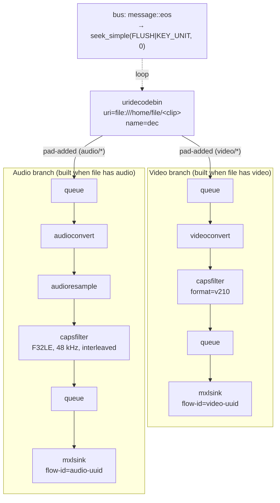
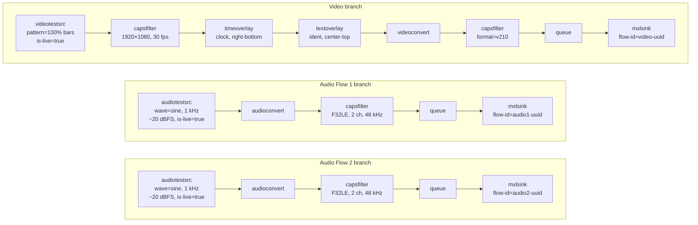
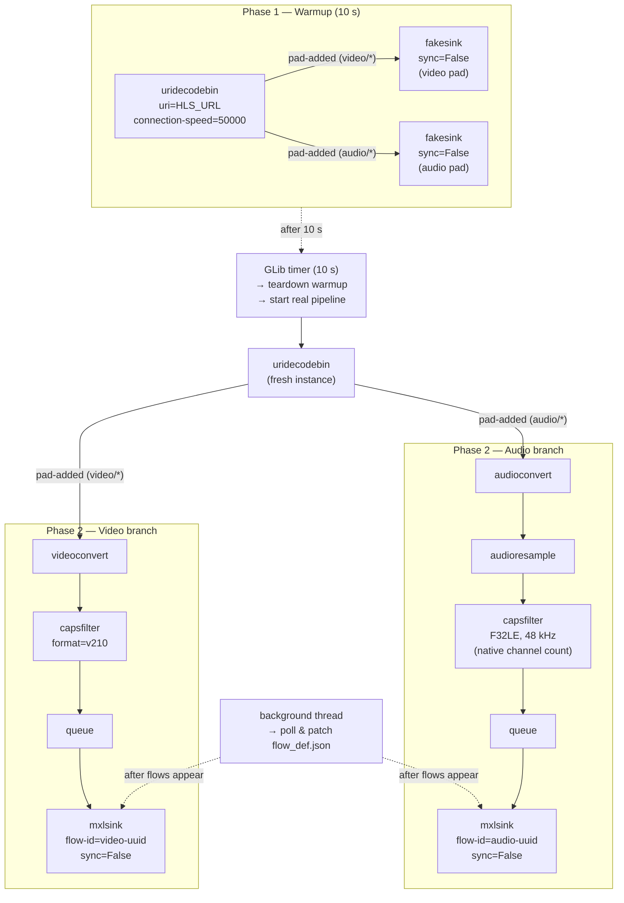
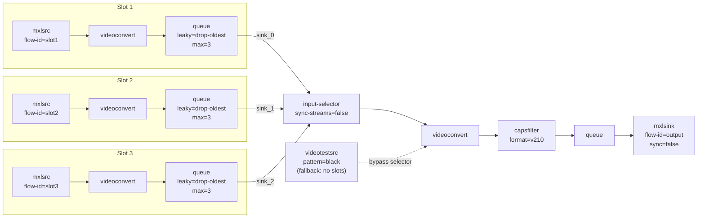
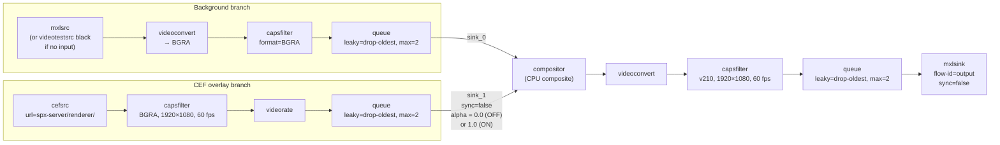
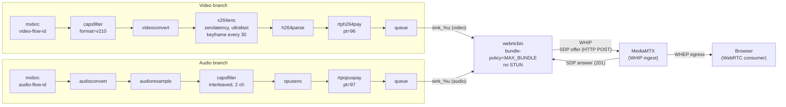

# Exercise 5 – GStreamer Pipelines Reference

Each section below describes one of the six GStreamer-based services, gives the equivalent
`gst-launch-1.0` command, explains what the pipeline does, and includes a Mermaid diagram.

---

## 1. File Player (`gst_player.py`)

### `gst-launch-1.0` command

```bash
gst-launch-1.0 \
  uridecodebin uri="file:///home/file/<clip>" name=dec \
  dec. ! queue ! videoconvert \
       ! "video/x-raw,format=v210" \
       ! queue \
       ! mxlsink flow-id="<video-uuid>" domain="/mxl-domain/<domain-uuid>.mxl-domain" \
  dec. ! queue ! audioconvert ! audioresample \
       ! "audio/x-raw,format=F32LE,layout=interleaved,rate=48000" \
       ! queue \
       ! mxlsink flow-id="<audio-uuid>" domain="/mxl-domain/<domain-uuid>.mxl-domain"
```

> **Note:** Flow UUIDs are **deterministic (UUID v5)** derived from the group hint
> (e.g. `Clip-Player:video`, `Clip-Player:audio`) — restarting with the same group hint
> reuses the same UUIDs and overwrites the existing flow files in the domain.
> Looping (seek-on-EOS) cannot be expressed in a `gst-launch` command and is implemented
> in Python on the bus watch.

### Explanation

Reads a local media file (`.ts` or `.mp4`, any resolution/frame rate) from `/home/file` and
republishes it as one or two MXL flows. The pipeline is user-controlled: the UI's **Setup**
section configures domain, group hint, file, and per-flow metadata; the pipeline only starts
when the user clicks **Start**.

**Source/decode** — `uridecodebin` is used in preference to a fixed demuxer + decoder pair
because the container and codecs are not known up-front: `.ts` files carry MPEG-TS with
H.264 or H.265, `.mp4` files carry ISO BMFF with the same, and the same UI must accept all
of them. `uridecodebin` inspects the file, picks the right demuxer + parser + decoder, and
exposes ready-to-consume raw video/audio pads via the `pad-added` signal. The backend probes
the file beforehand (`GstPbutils.Discoverer`) so it knows which branches to build, but the
actual pad-to-branch wiring happens dynamically at runtime once the pads appear.

**Dynamic pad linking** — the video and audio branches are pre-built (each ends at an
`mxlsink`) and their head queues' sink pads are held aside. When `uridecodebin` emits
`pad-added`, the new pad's caps are inspected: `video/*` pads are linked to the video branch
head, `audio/*` pads to the audio branch head. Pads for which no active branch was created
(e.g. audio pads on a video-only configuration) are ignored. This makes the pipeline
work uniformly for video-only, audio-only, and audio+video files.

**Video branch** — `queue → videoconvert → capsfilter(v210) → queue → mxlsink`
`videoconvert` is mandatory because the decoded video can arrive in many pixel formats
(I420, NV12, P010, …) depending on the source codec, and `mxlsink` only accepts the packed
10-bit `v210` format. The explicit `capsfilter` locks the negotiation to `v210`; without it
auto-negotiation may land on whatever the upstream prefers and cause a hard runtime failure.

**Audio branch** — `queue → audioconvert → audioresample → capsfilter(F32LE @ 48 kHz interleaved) → queue → mxlsink`
`audioconvert` handles sample-format conversion (the decoded audio is typically S16/S32 LE,
not float), `audioresample` rebinds the rate to 48 kHz regardless of the source rate
(44.1 kHz, 32 kHz, etc.), and the `capsfilter` locks the format to `F32LE` interleaved —
the only audio format `mxlsink` accepts. Channel count is whatever the source file provides.

**Looping** — playback runs continuously. A `message::eos` handler on the pipeline bus
catches end-of-stream and immediately issues a flushing key-unit seek to position 0:

```python
pipeline.seek_simple(Gst.Format.TIME,
                     Gst.SeekFlags.FLUSH | Gst.SeekFlags.KEY_UNIT, 0)
```

This restarts the file from the beginning without rebuilding the pipeline, so the MXL
flows remain alive across loops and consumers see a single continuous stream.

**Flow_def.json patching** — once the pipeline reaches PLAYING, a background thread polls
each `{domain}/{flow-uuid}.mxl-flow/flow_def.json` (up to 15 s) and patches `grouphint`,
`tags["urn:x-nmos:tag:grouphint/v1.0"]`, `description`, and `label` with the values entered
in the Setup form (`<grouphint>:Video` and `<grouphint>:Audio` respectively).

### Diagram



---

## 2. Test Generator (`gst_generator.py`)

### `gst-launch-1.0` command

```bash
gst-launch-1.0 \
  videotestsrc pattern=19 is-live=true \
    ! "video/x-raw,width=1920,height=1080,framerate=30/1" \
    ! timeoverlay font-desc="Sans Bold 28" halignment=right valignment=bottom shaded-background=true \
    ! textoverlay text="Test Generator" font-desc="Sans Bold 36" halignment=center valignment=top shaded-background=true \
    ! videoconvert \
    ! "video/x-raw,format=v210" \
    ! queue \
    ! mxlsink flow-id="<video-uuid>" domain="/mxl-domain/<domain-uuid>.mxl-domain" \
  audiotestsrc wave=0 freq=1000 volume=0.1 is-live=true \
    ! audioconvert \
    ! "audio/x-raw,format=F32LE,channels=2,rate=48000,layout=interleaved" \
    ! queue \
    ! mxlsink flow-id="<audio1-uuid>" domain="/mxl-domain/<domain-uuid>.mxl-domain" \
  audiotestsrc wave=0 freq=1000 volume=0.1 is-live=true \
    ! audioconvert \
    ! "audio/x-raw,format=F32LE,channels=2,rate=48000,layout=interleaved" \
    ! queue \
    ! mxlsink flow-id="<audio2-uuid>" domain="/mxl-domain/<domain-uuid>.mxl-domain"
```

> **Note:** `volume=0.1` ≈ −20 dBFS (`10^(−20/20)`). `wave=0` is a sine wave.
> `pattern=19` is the 100% colour bars (SMPTE full-range). Flow UUIDs are **deterministic
> (UUID v5)** derived from the group hint — restarting with the same group hint reuses the
> same UUIDs; changing the group hint produces a different set.

### Explanation

Generates three independent live test flows — one video and two audio — with no external
source. The pipeline is user-controlled: the UI's **Setup** section configures domain, raster,
frame rate, and per-flow metadata; the pipeline only starts when the user clicks **Start**.

**Video branch** — `videotestsrc → capsfilter(res+fps) → timeoverlay → textoverlay
→ videoconvert → capsfilter(v210) → queue → mxlsink`

`videotestsrc` generates synthetic colour-bar frames at the selected raster
(1280×720, 1920×1080, or 3840×2160) and frame rate (24/25/29.97/30/50/59.94/60 fps).
A `timeoverlay` burns the running pipeline clock into the bottom-right corner; a
`textoverlay` overlays a configurable ident string at the top centre.
Both overlays are live-adjustable (no pipeline rebuild required).
`videoconvert` is mandatory before the v210 capsfilter: `timeoverlay` and `textoverlay`
work in AYUV or I420 internally, and `videoconvert` translates that into the packed v210
format that `mxlsink` requires. Without this explicit capsfilter, auto-negotiation may
land on an incompatible pixel format and cause a hard runtime failure.

**Audio Flow 1 and Audio Flow 2** — each independently:
`audiotestsrc → audioconvert → capsfilter(F32LE, N ch, 48 kHz) → queue → mxlsink`

Each branch has its own `audiotestsrc` (independently configurable wave, level) feeding
its own `mxlsink` through its own UUID — the two flows are completely independent.
`audiotestsrc` natively produces float samples at whatever rate and channel count the
downstream capsfilter negotiates; `audioconvert` is present to handle any intermediate
format differences and to make the negotiation chain explicit.
The final capsfilter locks the format to `F32LE` interleaved, which is the only audio
format `mxlsink` accepts. Channel count (1–64) is configured per flow in the Setup
section before the pipeline starts and is fixed for its lifetime — it cannot be changed
without a Stop + Start because caps renegotiation across a running mxlsink is not
reliable. Audio level (−60 … 0 dBFS in 0.5 dB steps) is adjustable live.

The pipeline is brought directly to `PLAYING` state. A background thread then polls for
each flow's `{domain}/{uuid}.mxl-flow/flow_def.json` (up to 15 s) and patches the
`grouphint`, `description`, and `label` fields with the values entered in the Setup form.

### Diagram



---

## 3. HLS-to-MXL Gateway (`gst_hls2mxl.py`)

### `gst-launch-1.0` commands

**Phase 1 — Warmup (10 s, not shown — one fakesink per decoded pad, sync=false)**

> This phase uses a throw-away pipeline. There is no meaningful `gst-launch-1.0` equivalent
> because it creates fakesinks dynamically for every decoded pad via `pad-added`.

**Phase 2 — Real pipeline (after warmup)**

> **Note:** `gst-launch-1.0` cannot reproduce the dynamic `pad-added` wiring from
> `uridecodebin`. The command below shows the static equivalent; the actual Python
> implementation connects the pads dynamically at runtime.

```bash
gst-launch-1.0 \
  uridecodebin uri="<HLS_URL>" connection-speed=50000 name=dec \
  dec. ! videoconvert \
       ! "video/x-raw,format=v210" \
       ! queue \
       ! mxlsink flow-id="<video-uuid>" domain="/mxl-domain/<domain-path>" sync=false \
  dec. ! audioconvert ! audioresample \
       ! "audio/x-raw,format=F32LE,rate=48000,layout=interleaved" \
       ! queue \
       ! mxlsink flow-id="<audio-uuid>" domain="/mxl-domain/<domain-path>" sync=false
```

> Flow UUIDs are **deterministic (UUID v5)** derived from
> `_MXL_HLS_NS` + `"<grouphint>:video"` / `"<grouphint>:audio"` — applying a new HLS URL
> preserves the same UUIDs as long as the group hint is unchanged.

### Explanation

Ingests any HLS stream and republishes it as one video and one audio MXL flow, accepting
whatever resolution, frame rate, and channel count the source provides.

**`uridecodebin` over a static source chain** — a fixed `souphttpsrc ! hlsdemux ! decodebin`
chain would need to be hard-wired to specific codecs and would fail on variant streams that
switch codecs. `uridecodebin` probes the stream, selects the right demuxer, parser, and
decoder, and exposes raw pads via `pad-added`. This allows the pipeline to work transparently
with H.264, H.265, AAC, MP3, and any other codec the HLS stream delivers.

**Two-phase startup** — the gateway uses two successive pipelines rather than a single
pipeline with valve elements:

- **Phase 1 (warmup, 10 s):** `uridecodebin` is connected to per-pad `fakesink(sync=False)`
  instances. Every decoded pad gets its own fakesink added dynamically via `pad-added`.
  This allows the HLS adaptive-bitrate logic to select the highest quality variant and fully
  buffer the stream, without involving `mxlsink` at all. After 10 seconds a GLib timer fires,
  tears down the warmup pipeline, and starts Phase 2.

- **Phase 2 (real pipeline):** a fresh `uridecodebin` is started with `mxlsink(sync=False)`
  as the final sink for each branch. With `sync=False`, the sink does not block the GStreamer
  state machine waiting for clock-synchronised preroll, so both video and audio branches reach
  PLAYING immediately and data flows reliably.

  > **Why not valves?**  A `valve(drop=True)` placed before `mxlsink` blocks the sink's
  > preroll: `GstBaseSink` needs to receive a buffer to complete the PAUSED→PLAYING transition,
  > and the valve prevents that.  This leaves the pipeline in ASYNC state.  After ~2 s in
  > ASYNC, the HLS audio decoder stops producing data (its internal segment buffer drains and
  > the demuxer throttles), so when the valve finally opens, audio data is gone.  Video appears
  > to survive because its larger frame buffers are re-fed sooner.  The two-phase approach
  > avoids this entirely — mxlsinks are only introduced once the stream is already stable.

**Dynamic pad linking** — the video and audio branches are pre-built before the source is
connected. When `uridecodebin` emits `pad-added`, the cap's structure name is inspected:
`video/*` pads link to `videoconvert`, `audio/*` pads link to `audioconvert`. Only the first
video and first audio pad are used; additional pads (e.g. subtitle tracks) are ignored. This
is necessary because `uridecodebin` creates pads asynchronously once it has enough data to
negotiate the stream format.

**Video branch** — `videoconvert → capsfilter(v210) → queue → mxlsink(sync=False)`
`videoconvert` converts whatever pixel format the HLS decoder produces (I420, NV12, P010,
etc.) to the v210 packed 10-bit format that `mxlsink` requires. No resolution or frame-rate
constraint is applied — the pipeline passes through the source's native geometry.

**Audio branch** — `audioconvert → audioresample → capsfilter(F32LE, 48 kHz) → queue → mxlsink(sync=False)`
`audioconvert` handles sample-format conversion (AAC typically decodes to F32LE non-interleaved;
`audioconvert` converts to interleaved), `audioresample` converts the source sample rate to
48 kHz. The capsfilter intentionally does **not** constrain the channel count — whatever
number of channels the source provides is passed through to `mxlsink` unmodified.

**Apply / re-link** — when the user applies a new HLS URL while the pipeline is running, the
current pipeline is torn down and the two-phase startup restarts with the new URI.
Because flow UUIDs are derived from the group hint (not the URL), they are identical before
and after the apply, so downstream MXL consumers observe seamless flow-ID continuity.

### Diagram



---

## 4. Input Selector (`gst_selector.py`)

### `gst-launch-1.0` command

**With connected slots (example with 3 inputs)**

```bash
gst-launch-1.0 \
  input-selector name=sel sync-streams=false \
  mxlsrc video-flow-id="<flow-id-1>" domain="/mxl-domain" \
       ! videoconvert ! queue leaky=1 max-size-buffers=3 ! sel.sink_0 \
  mxlsrc video-flow-id="<flow-id-2>" domain="/mxl-domain" \
       ! videoconvert ! queue leaky=1 max-size-buffers=3 ! sel.sink_1 \
  mxlsrc video-flow-id="<flow-id-3>" domain="/mxl-domain" \
       ! videoconvert ! queue leaky=1 max-size-buffers=3 ! sel.sink_2 \
  sel. ! videoconvert \
       ! "video/x-raw,format=v210" \
       ! queue \
       ! mxlsink flow-id="<output-flow-id>" domain="/mxl-domain" sync=false
```

**When no input is connected (black output fallback)**

```bash
gst-launch-1.0 \
  videotestsrc pattern=2 is-live=true \
  ! videoconvert \
  ! "video/x-raw,format=v210" \
  ! mxlsink flow-id="<output-flow-id>" domain="/mxl-domain" sync=false
```

### Explanation

Implements a **2-step vision mixer switch**: a `select` call pre-arms the desired input,
and a `take` call atomically switches the output — matching the traditional on-air take paradigm.

Up to three `mxlsrc` sources (NMOS receivers, slots 1–3) feed an `input-selector` element.
Each branch has a small leaky queue (`leaky=1` drops the oldest frame on overflow) to decouple
the sources from the selector without building up latency.  The selector's single output feeds a
`videoconvert` and then `mxlsink`.

When no slot is connected the `input-selector` is bypassed entirely and a black
`videotestsrc` is linked directly to the output sink, keeping the MXL flow alive.
The pipeline is rebuilt whenever a slot is connected or disconnected; the active pad selection
is restored after each rebuild.

### Diagram



---

## 5. HTML5 Keyer (`gst_keyer.py`)

### `gst-launch-1.0` command

```bash
gst-launch-1.0 \
  compositor name=mixer \
  mxlsrc video-flow-id="<input-flow-id>" domain="/mxl-domain" \
       ! videoconvert \
       ! "video/x-raw,format=BGRA" \
       ! queue leaky=2 max-size-buffers=2 max-size-time=0 max-size-bytes=0 \
       ! mixer.sink_0 \
  cefsrc url="http://spx-server:5660/renderer/" \
       ! "video/x-raw,format=BGRA,width=1920,height=1080,framerate=60/1" \
       ! videorate \
       ! queue leaky=2 max-size-buffers=2 max-size-time=0 max-size-bytes=0 \
       ! mixer.sink_1 \
  mixer. ! videoconvert \
       ! "video/x-raw,format=v210,width=1920,height=1080,framerate=60/1" \
       ! queue leaky=2 max-size-buffers=2 \
       ! mxlsink flow-id="<output-flow-id>" domain="/mxl-domain" sync=false
```

> **Key toggle:** adjust the `alpha` property on `mixer.sink_1` at runtime
> (`0.0` = key OFF, `1.0` = key ON) without rebuilding the pipeline.
>
> **`sync=false` on `mixer.sink_1`:** set programmatically via the element API — not
> expressible in a `gst-launch` capsfilter; in the Python code it is set directly on the
> `Gst.Pad` object returned by `mixer.get_request_pad("sink_%u")`.

### Explanation

Composites an HTML5 graphics overlay (rendered by a Chrome/CEF browser pointed at an SPX
graphics server) on top of a live MXL video background using CPU-based mixing via `compositor`.

The **background branch** reads an MXL flow (or falls back to a black `videotestsrc` when no
receiver is connected). `videoconvert` converts v210 to BGRA so that `compositor` receives the
same pixel format on both pads without internal conversion. The queue is leaky (drop-oldest, 2
frames) — mandatory for a live pipeline to avoid buffering stale frames that would appear as
repeated or frozen video.

The **CEF overlay branch** connects `cefsrc` to the SPX renderer URL which delivers the HTML5
graphic in BGRA format (alpha channel preserved for keying).  A `videorate` element guarantees
a steady 60 fps feed to the mixer even when the browser renders at a lower rate.

`compositor` (CPU-based) is used instead of `glvideomixer` (GPU) for two reasons:
- Its sink pads support `sync=false` — `sink_1` (CEF) is set to `sync=false` so the mixer
  composites immediately without stalling to align CEF timestamps with the mxlsrc clock domain.
- No `glupload`/`gldownload` round-trip, saving ~950 MB/s of GPU memory bandwidth.

Toggling the key simply sets the `alpha` property on `sink_1` (the CEF pad) between `0.0`
and `1.0` — no pipeline rebuild needed.

The composited output is converted to v210 and written to `mxlsink`.
The pipeline is only rebuilt when the MXL receiver connection changes.

### Diagram



---

## 6. MXL-to-WebRTC (`gst_mxl2webrtc.py`)

### `gst-launch-1.0` command

```bash
gst-launch-1.0 \
  webrtcbin name=wb bundle-policy=3 stun-server="" \
  mxlsrc video-flow-id="<video-flow-id>" domain="/mxl-domain" \
       ! "video/x-raw,format=v210" \
       ! videoconvert \
       ! x264enc tune=4 speed-preset=2 key-int-max=30 \
       ! h264parse \
       ! rtph264pay pt=96 config-interval=-1 \
       ! "application/x-rtp,media=video,encoding-name=H264,payload=96" \
       ! queue \
       ! wb.sink_%u \
  mxlsrc audio-flow-id="<audio-flow-id>" domain="/mxl-domain" \
       ! audioconvert ! audioresample \
       ! "audio/x-raw,layout=interleaved,channels=2" \
       ! opusenc \
       ! rtpopuspay pt=97 \
       ! queue \
       ! wb.sink_%u
```

> **WHIP signalling:** the SDP offer/answer exchange with MediaMTX is handled entirely by
> the Python code (HTTP POST to `MEDIAMTX_WHIP_URL`) and cannot be expressed in a
> `gst-launch` command. `bundle-policy=3` is `MAX_BUNDLE`. `tune=4` is the `zerolatency`
> bitmask for x264enc. `speed-preset=2` is `ultrafast`.

### Explanation

Transcodes two MXL flows (video + audio), packages them as RTP, and publishes to a
**MediaMTX** server via **WHIP** (WebRTC HTTP Ingest Protocol). Browsers watch the stream
from MediaMTX via **WHEP** (WebRTC HTTP Egress Protocol).

The **video branch** reads the MXL video flow as v210 and converts it to a format
`x264enc` accepts.  The encoder is tuned for minimum latency (`zerolatency`) and maximum
speed (`ultrafast`, `speed-preset=2`), with a keyframe every 30 frames.  `h264parse`
normalises the bitstream, and `rtph264pay` wraps it in RTP at payload type 96.

The **audio branch** reads the MXL audio, converts and resamples it, downmixes to stereo
(2 channels — the reliable maximum for Opus), encodes to Opus, and wraps the result in RTP
via `rtpopuspay` at payload type 97. The `capsfilter(channels=2)` is placed **after**
`audioconvert` and `audioresample` so those elements can negotiate the downmix; placing it
directly after `mxlsrc` causes an "Internal data stream error" when the source has more
than 2 channels.

Both RTP streams are fed into **`webrtcbin`** with `bundle-policy=MAX_BUNDLE` (single
transport for both media). No STUN server is configured — the app runs within a local
Docker network where ICE host candidates are sufficient.

**WHIP handshake** (Python-managed, not in the GStreamer pipeline):
1. `webrtcbin` fires `on-negotiation-needed` → Python calls `create-offer`.
2. Python sets the local description and waits up to 10 s for ICE gathering to complete.
3. The fully-gathered SDP offer is HTTP POST'd to the MediaMTX WHIP endpoint
   (`MEDIAMTX_WHIP_URL`, default `http://localhost:8889/mxl2webrtc/whip`).
4. MediaMTX responds with a 201 and an SDP answer; Python calls `set-remote-description`.

**MediaMTX** acts as a WebRTC relay: it ingests the stream via WHIP and re-exposes it
for browsers via WHEP. The browser navigates to the MediaMTX WHEP URL and receives the
H.264 + Opus stream directly.

### Diagram


